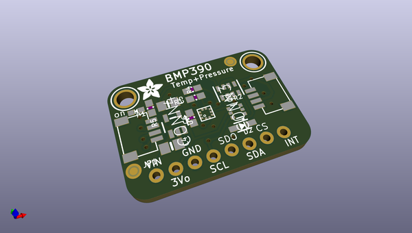
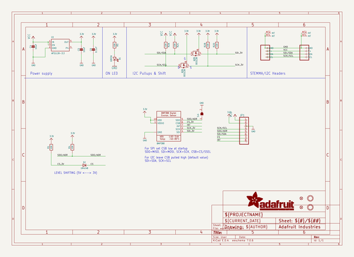
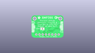
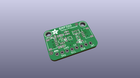
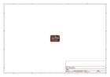
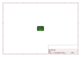
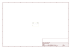
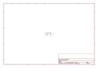

# OOMP Project  
## Adafruit-BMP3xx-PCB  by adafruit  
  
oomp key: oomp_projects_flat_adafruit_adafruit_bmp3xx_pcb  
(snippet of original readme)  
  
-- Adafruit BMP3xx - Precision Barometric Pressure and Altimeter PCB  
  
<a href="http://www.adafruit.com/products/3966">   
<a href="http://www.adafruit.com/products/3966">   
<a href="http://www.adafruit.com/products/4816">   
Click here to purchase one from the Adafruit shop</a>  
  
PCB files for the Adafruit BMP388 - Precision Barometric Pressure and Altimeter. Format is EagleCAD schematic and board layout  
* https://www.adafruit.com/product/3966  
* https://www.adafruit.com/product/4816  
  
--- Description  
  
Bosch has been a leader in barometric pressure sensors, from the [BMP085](https://www.adafruit.com/product/1603), [BMP180](https://www.adafruit.com/product/1603), and [BMP280](https://www.adafruit.com/product/2651)... now we've got the next generation, the **Adafruit BMP3xx Precision Barometric Pressure sensor**. As you would expect, this sensor is similar to its earlier versions but even better. The BMP388 has better precision than ever, which makes it excellent for environmental sensing or as a **precision altimeter**. It can even be used in either I2C and SPI configurations.  
  
The BMP388 is the next-generation of sensors from Bosch, and is the upgrade to the BMP280 - with a low altitude noise as low as 0.1m and the same fast conversion time. And like the previous BMP280, you can use I2C or SPI. For simple easy wiring,  
  full source readme at [readme_src.md](readme_src.md)  
  
source repo at: [https://github.com/adafruit/Adafruit-BMP3xx-PCB](https://github.com/adafruit/Adafruit-BMP3xx-PCB)  
## Board  
  
  
## Schematic  
  
  
  
[schematic pdf](working_schematic.pdf)  
## Images  
  
  
  
  
  
  
  
  
  
  
  
  
  
  
  
  
