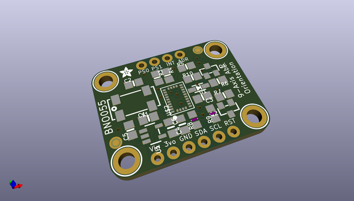
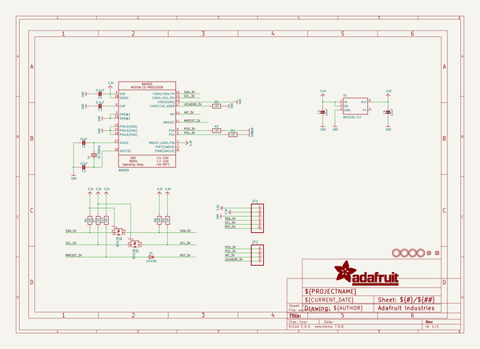

# OOMP Project  
## Adafruit-BNO055-Breakout-PCB  by adafruit  
  
oomp key: oomp_projects_flat_adafruit_adafruit_bno055_breakout_pcb  
(snippet of original readme)  
  
-- Adafruit BNO055 Breakout PCB  
  
   
   
Click here to purchase one from the Adafruit shop  
  
PCB files for the BNO055 Breakout. Format is EagleCAD schematic and board layout  
* https://www.adafruit.com/product/2472  
* https://www.adafruit.com/product/4646  
  
--- Description  
  
If you've ever ordered and wire up a 9-DOF sensor, chances are you've also realized the challenge of turning the sensor data from an accelerometer, gyroscope and magnetometer into actual "3D space orientation"! Orientation is a hard problem to solve. The sensor fusion algorithms (the secret sauce that blends accelerometer, magnetometer and gyroscope data into stable three-axis orientation output) can be mind-numbingly difficult to get right and implement on low cost real time systems.  
  
Bosch is the first company to get this right by taking a MEMS accelerometer, magnetometer and gyroscope and putting them on a single die with a high speed ARM Cortex-M0 based processor to digest all the sensor data, abstract the sensor fusion and real time requirements away, and spit out data you can use in quaternions, Euler angles or vectors.  
  
The new version of the board includes SparkFun qwiic compatible STEMMA QT connectors for the I2C bus so you don't even need to solder! Use a a plug-and-play STEMMA QT cable to get 9  
  full source readme at [readme_src.md](readme_src.md)  
  
source repo at: [https://github.com/adafruit/Adafruit-BNO055-Breakout-PCB](https://github.com/adafruit/Adafruit-BNO055-Breakout-PCB)  
## Board  
  
  
## Schematic  
  
  
  
[schematic pdf](working_schematic.pdf)  
## Images  
  
  
  
  
  
  
  
  
  
  
  
  
  
  
  
  
