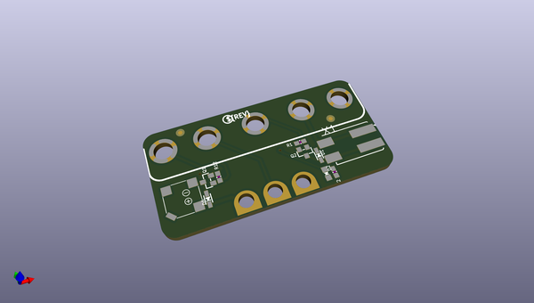

# OOMP Project  
## Adafruit-Bonsai-Buckaroo-PCB  by adafruit  
  
(snippet of original readme)  
  
-- Adafruit Bonsai Buckaroo PCB  
  
<a href="http://www.adafruit.com/products/4534">   
Click here to purchase one from the Adafruit shop</a>  
  
PCB files for the Adafruit Bonsai Buckaroo.   
  
Format is EagleCAD schematic and board layout  
* https://www.adafruit.com/product/4534  
  
--- Description  
  
We can’t wait for spring to arrive, and we’re looking forward to caring for some plants! We designed this little add-on for micro:bit or CLUE boards – bolt it on with 5 screws to get a buzzer/beeper, motor driver, and breakouts for connecting a soil sensor (two alligator clips + nails work just fine). Simple, but effective!  
  
* 8mm Buzzer/Speaker on pin P0 - have your plant kit beep when it wants watering, or have it sing a song when its nice and happy.  
* 3V Motor control (on/off) on pin P2 - connect to a water pump to automatically water dry plants  
* Alligator clip pads for pin P1, 3V and GND - connect to two alligator clips and nails to measure soil resistance  
  
Works with micro:bit in Arduino, micropython or MakeCode. For CLUE, you can use CircuitPython or Arduino.  
  
Please note this product does not come with a pump, tubing, alligator clips, nails, CLUE or micro:bit! It's just the control board that attaches to the micro:bit or CLUE!  
  
--- License  
  
Adafruit invests time and resources providing this open source design, please support Adafruit and open-source hardware by purchasing products from [Adafruit](https://www.adafruit.com)!  
  
Designed  
  full source readme at [readme_src.md](readme_src.md)  
  
source repo at: [https://github.com/adafruit/Adafruit-Bonsai-Buckaroo-PCB](https://github.com/adafruit/Adafruit-Bonsai-Buckaroo-PCB)  
## Board  
  
  
## Schematic  
  
  
  
[schematic pdf](working_schematic.pdf)  
## Images  
