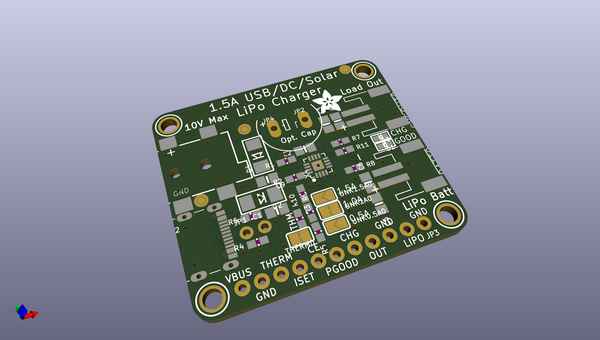
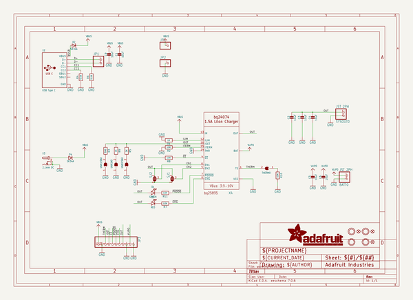
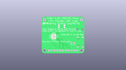
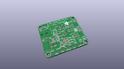
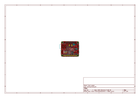
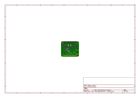
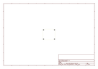
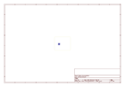
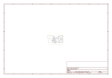

# OOMP Project  
## Adafruit-BQ24074-PCB  by adafruit  
  
oomp key: oomp_projects_flat_adafruit_adafruit_bq24074_pcb  
(snippet of original readme)  
  
-- Adafruit BQ24074 Solar Charger PCB  
  
<a href="https://www.adafruit.com/product/4755">   
Click here to purchase one from the Adafruit shop</a>  
  
PCB files for the Adafruit BQ24074 Solar Charger.   
  
Format is EagleCAD schematic and board layout  
* https://www.adafruit.com/product/4755  
  
--- Description  
  
This charger is the only one you need to keep all your Lithium Polymer (LiPoly) or Lithium Ion (LiIon) rechargeable batteries topped up. No matter the power source at your disposal! The Adafruit Universal USB / DC / Solar Lithium Ion/Polymer Charger can use USB, DC or Solar power, with a wide 5-10V input voltage range! The charger chip is super smart, and will reduce the current draw if the input voltage starts to dip under 4.5V, making it a perfect near-MPPT solar charger that you can use with a wide range of panels.  
  
--- License  
  
Adafruit invests time and resources providing this open source design, please support Adafruit and open-source hardware by purchasing products from [Adafruit](https://www.adafruit.com)!  
  
Designed by Limor Fried/Ladyada for Adafruit Industries.  
  
Creative Commons Attribution/Share-Alike, all text above must be included in any redistribution.   
See license.txt for additional details.  
  
  full source readme at [readme_src.md](readme_src.md)  
  
source repo at: [https://github.com/adafruit/Adafruit-BQ24074-PCB](https://github.com/adafruit/Adafruit-BQ24074-PCB)  
## Board  
  
  
## Schematic  
  
  
  
[schematic pdf](working_schematic.pdf)  
## Images  
  
  
  
  
  
  
  
  
  
  
  
  
  
  
  
  
