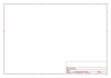
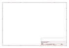

# OOMP Project  
## Adafruit_Brain-Machine-Kit  by adafruit  
  
(snippet of original readme)  
  
- The Brain Machine Kit  
  
<a href="http://www.adafruit.com/products/287">   
Click here to purchase one from the Adafruit shop  
</a>  
  
Relax and rejuvenate as your brain synchronizes to a wonderful meditative state, and enjoy as you hallucinate beautiful colors and patterns from your subconscious mind!  
  
The Brain Machine provides you with a fun, easy way to meditate, all the while being very photogenic! They work with lights and sounds that pulse at a 14-minute-long meditation sequence of brainwave frequencies. Your brain synchronizes to this meditation sequence, and you meditate. It's that easy! And the beautiful colors and patterns you vividly imagine along the way make it fun and enjoyable. __The Brain Machine works with blinking lights. Be aware that blinking lights are not good for some people, especially those prone to seizures!__  
  
Build your own Brain Machine to expand your brain's technical skills, then lean back and enjoy the light show. They are a blast at parties, a fun way to practice meditation and trip out.  
  
The Brain Machine Kit is an unassembled DIY kit - [all the parts needed to make it are included](https://learn.adafruit.com/brain-machine):  
  
- High quality Printed Circuit Board  
- All electrical components, including pre-programmed microcontroller, wires, LEDs  
- Over-ear headphones  
- Dark-tinted safety glasses (fits children and adults)  
- Color printed overlay for fashionability  
- 2 x AAA batteries included -  
  full source readme at [readme_src.md](readme_src.md)  
  
source repo at: [https://github.com/adafruit/Adafruit_Brain-Machine-Kit](https://github.com/adafruit/Adafruit_Brain-Machine-Kit)  
## Board  
  
  
## Schematic  
  
  
  
[schematic pdf](working_schematic.pdf)  
## Images  
  
  
  
  
  
  
  
  
  
  
  
  
  
  
  
  
