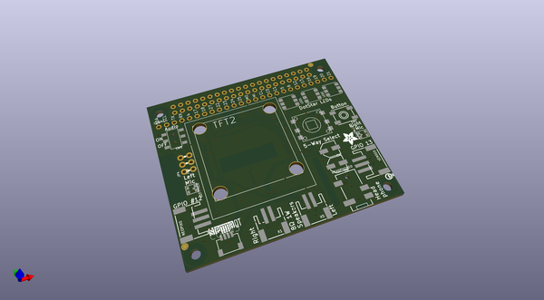
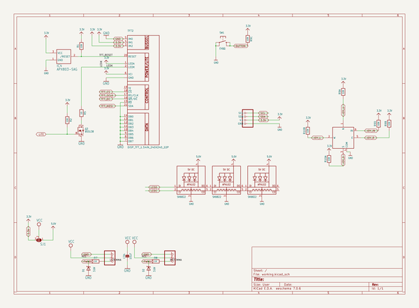

# OOMP Project  
## Adafruit-BrainCraft-HAT-PCB  by adafruit  
  
oomp key: oomp_projects_flat_adafruit_adafruit_braincraft_hat_pcb  
(snippet of original readme)  
  
-- Adafruit Adafruit BrainCraft HAT - Machine Learning for Raspberry Pi 4 PCB  
  
<a href="http://www.adafruit.com/products/4374">   
Click here to purchase one from the Adafruit shop</a>  
  
PCB files for the Adafruit BrainCraft HAT - Machine Learning for Raspberry Pi 4.   
  
Format is EagleCAD schematic and board layout  
* https://www.adafruit.com/product/4374  
  
--- Description  
  
The idea behind the BrainCraft HAT is that you’d be able to “craft brains” for Machine Learning on the EDGE, with Microcontrollers & Microcomputers. On ASK AN ENGINEER, our founder & engineer chatted with Pete Warden, the technical lead of the mobile, embedded TensorFlow Group on Google’s Brain team about what would be ideal for a board like this.  
  
And here’s what we designed! The BrainCraft HAT has a 240×240 TFT IPS display for inference output, slots for camera connector cable for imaging projects, a 5 way joystick and button for UI input, left and right microphones, stereo headphone out, stereo 1 W speaker out, three RGB DotStar LEDs, two 3 pin STEMMA connectors on PWM pins so they can drive NeoPixels or servos, and Grove/STEMMA/Qwiic I2C port. This will let people build a wide range of audio/video AI projects while also allowing easy plug-in of sensors and robotics!  
  
A controllable mini fan attaches to the bottom, and can be used to keep your Pi cool while doing intense AI inference calculations. **Most importantly, there’s an On/Off switch that will comp  
  full source readme at [readme_src.md](readme_src.md)  
  
source repo at: [https://github.com/adafruit/Adafruit-BrainCraft-HAT-PCB](https://github.com/adafruit/Adafruit-BrainCraft-HAT-PCB)  
## Board  
  
  
## Schematic  
  
  
  
[schematic pdf](working_schematic.pdf)  
## Images  
