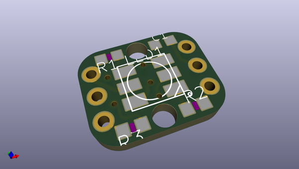
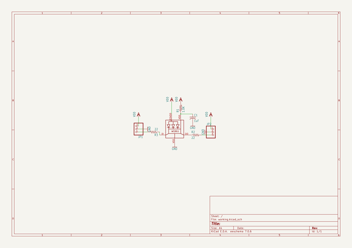
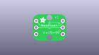
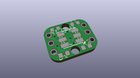
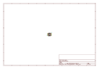
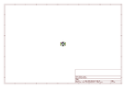
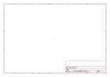
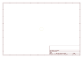
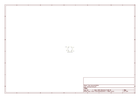

# OOMP Project  
## Adafruit_Breadboard_NeoPixel_PCB  by adafruit  
  
(snippet of original readme)  
  
- PCB for the Adafruit Breadboard-able NeoPixels  
  
__Format is EagleCAD schematic and board layout__  
  
<a href="http://www.adafruit.com/products/1312"> Click here to purchase one from the Adafruit shop</a>  
  
This is the easiest way possible to add small, bright RGB pixels to your project. We took the same technology from our Flora NeoPixels and made them breadboard friendly, with two rows of 3 x 0.1" spaced header on each side for easy soldering, chaining and breadboarding. These ultra-bright LEDs have a constant-current driver cooked right into the LED package! The pixels are chainable - so you only need 1 pin/wire to control as many LEDs as you like.  
  
These pixels have full 24-bit color ability with PWM taken care of by the controller chip. Since the LED is so bright, you need less current/power to get the effects you want. The driver is constant current so its OK if your battery power changes or fluctuates a little.  
  
Each pixel draws as much as 60mA (all three RGB LEDs on for full brightness white). An Arduino can drive up to 500 pixels at 30 FPS (it will run out of RAM after that). Using ribbon cable you can string these up to 6" apart (after that, you might get power droops and data corruption)  
  
Each order comes with 4 individually controllable pixels. In the photos above we show the pixels with headers soldered on, but the pixels do not come with any headers. [You can pick up some in the shop if you need](http://adafru  
  full source readme at [readme_src.md](readme_src.md)  
  
source repo at: [https://github.com/adafruit/Adafruit_Breadboard_NeoPixel_PCB](https://github.com/adafruit/Adafruit_Breadboard_NeoPixel_PCB)  
## Board  
  
  
## Schematic  
  
  
  
[schematic pdf](working_schematic.pdf)  
## Images  
  
  
  
  
  
  
  
  
  
  
  
  
  
  
  
  
