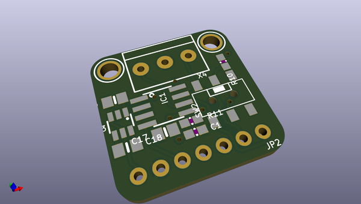

# OOMP Project  
## Adafruit-CAN-Pal-PCB  by adafruit  
  
(snippet of original readme)  
  
-- Adafruit CAN Pal - CAN Bus Transciever - TJA1051T/3 PCB  
  
<a href="http://www.adafruit.com/products/5708">   
Click here to purchase one from the Adafruit shop</a>  
  
PCB files for the Adafruit CAN Pal - CAN Bus Transciever - TJA1051T/3.   
  
Format is EagleCAD schematic and board layout  
* https://www.adafruit.com/product/5708  
  
--- Description  
  
If you'd like to connect a board with native CAN Peripheral support, the Adafruit CAN Pal Transceiver will take the 3V logic level signals and convert them to CAN logic levels with the differential signaling required to communicate. Note that not all chips have a CAN peripheral! Some that we know do have it are the ESP32/ESP32-S2/ESP32-S3 (note that ESP32 calls this interface TWAI not CAN) series of chips, SAME51, STM32F405, or Teensy 4.  
  
Check the product documentation for the board you are wiring this to, to make sure that the chip has CAN support and the RX and TX pins are brought out for you to connect the transceiver to! Despite sharing the 'RX' and 'TX' name with UART, they're not at all the same interface.  
  
CAN Bus is a small-scale networking standard, originally designed for cars and, yes, busses, but is now used for many robotics or sensor networks that need better range and addressing than I2C, and don't have the pins or computational ability to talk on Ethernet. CAN is 2 wire differential, which means it's good for long distances and noisy environments.  
  
Messages are sent at a  
  full source readme at [readme_src.md](readme_src.md)  
  
source repo at: [https://github.com/adafruit/Adafruit-CAN-Pal-PCB](https://github.com/adafruit/Adafruit-CAN-Pal-PCB)  
## Board  
  
  
## Schematic  
  
  
  
[schematic pdf](working_schematic.pdf)  
## Images  
  
  
  
  
  
  
  
  
  
  
  
  
  
  
  
  
