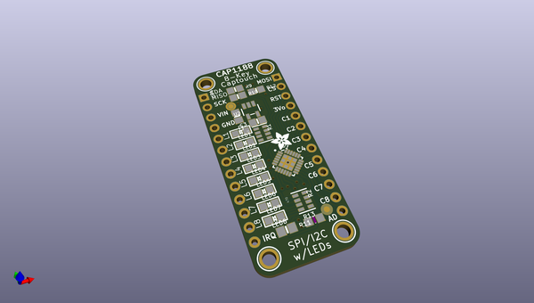
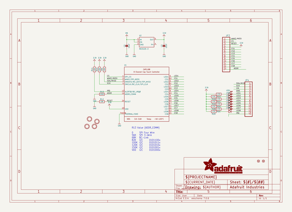
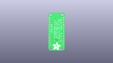
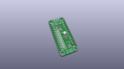
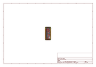
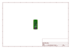
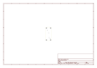
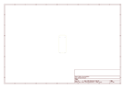

# OOMP Project  
## Adafruit-CAP1188-PCB  by adafruit  
  
oomp key: oomp_projects_flat_adafruit_adafruit_cap1188_pcb  
(snippet of original readme)  
  
-- Adafruit CAP1188 I2C/SPI capacitive touch breakout PCB  
<a href="http://www.adafruit.com/products/1602">   
Click here to purchase one from the Adafruit shop</a>  
  
Add lots of touch sensors to your next microcontroller project with this easy-to-use 8-channel capacitive touch sensor breakout board, starring the CAP1188. This chip can handle up to 8 individual touch pads, and has a very nice feature that makes it stand out for us: it will light up the 8 onboard LEDs when the matching touch sensor fires to help you debug your sensor setup.  
  
The CAP1188 has support for both I2C and SPI, so it easy to use with any microcontroller. If you are using I2C, you can select one of 5 addresses, for a total of 40 capacitive touch pads on one I2C 2-wire bus. Using this chip is a lot easier than doing the capacitive sensing with analog inputs: it handles all the filtering for you and can be configured for more/less sensitivity.  
  
PCB files for Adafruit CAP1188. The format is EagleCAD schematic and board layout  
- https://www.adafruit.com/product/1602  
  
--- License  
  
Adafruit invests time and resources providing this open source design, please support Adafruit and open-source hardware by purchasing products from [Adafruit](https://www.adafruit.com)!  
  
All text above must be included in any redistribution  
  
Designed by Limor Fried/Ladyada for Adafruit Industries.  
Creative Commons Attribution/Share-Alike, all text above must be included in any red  
  full source readme at [readme_src.md](readme_src.md)  
  
source repo at: [https://github.com/adafruit/Adafruit-CAP1188-PCB](https://github.com/adafruit/Adafruit-CAP1188-PCB)  
## Board  
  
  
## Schematic  
  
  
  
[schematic pdf](working_schematic.pdf)  
## Images  
  
  
  
  
  
  
  
  
  
  
  
  
  
  
  
  
