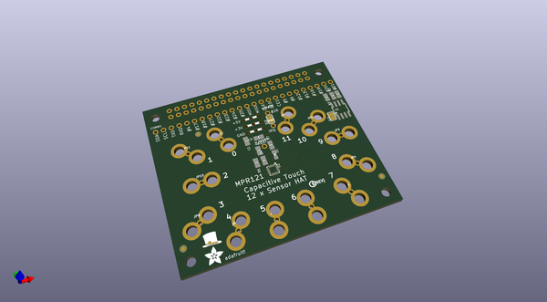
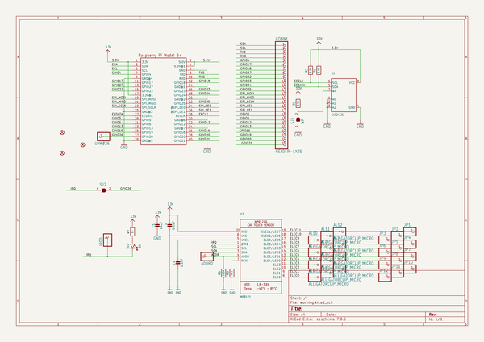
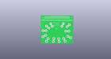
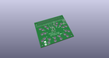
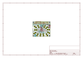
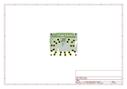
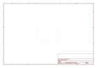
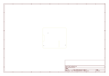
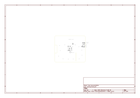

# OOMP Project  
## Adafruit-Capacitive-Touch-HAT-PCB  by adafruit  
  
(snippet of original readme)  
  
-- Adafruit Capacitive Touch HAT PCB  
<a href="http://www.adafruit.com/products/2340">   
Click here to purchase one from the Adafruit shop</a>  
  
This touch-able add on HAT for Raspberry Pi will inspire your next interactive project with 12 capacitive touch sensors. Capacitive touch sensing works by detecting when a person (or animal) has touched one of the sensor electrodes. Capacitive touch sensing used for stuff like touch-reactive tablets and phones, as well as control panels for appliances, which is where you may have used it before. This HAT allows you to create electronics that can react to human touch, with up to 12 individual sensors.  
  
The HAT has 12 'figure 8' holes in it that can be gripped onto with alligator clip cables. Attach one side of the clip to the HAT and the other side to something electrically conductive (like metal) or full of water (like vegetables or fruit!) Then start up our handy Python library code to detect when the object is touched. That's pretty much it, very easy! For advanced users, you can also solder to a pad to make a slimmer & more permanent connection.  
  
PCB files for the Adafruit Capacitive Touch HAT. The format is EagleCAD schematic and board layout  
- https://www.adafruit.com/products/2340  
  
--- License  
  
Adafruit invests time and resources providing this open source design, please support Adafruit and open-source hardware by purchasing products from [Adafruit](https://www.adafruit.com)!  
  full source readme at [readme_src.md](readme_src.md)  
  
source repo at: [https://github.com/adafruit/Adafruit-Capacitive-Touch-HAT-PCB](https://github.com/adafruit/Adafruit-Capacitive-Touch-HAT-PCB)  
## Board  
  
  
## Schematic  
  
  
  
[schematic pdf](working_schematic.pdf)  
## Images  
  
  
  
  
  
  
  
  
  
  
  
  
  
  
  
  
