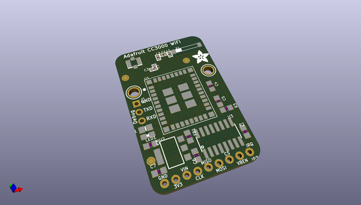
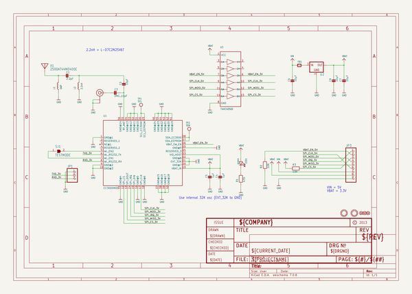
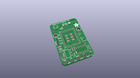
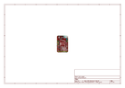
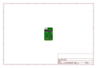
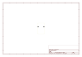
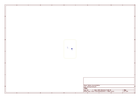
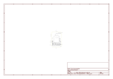

# OOMP Project  
## Adafruit-CC3000-Breakout-PCB  by adafruit  
  
oomp key: oomp_projects_flat_adafruit_adafruit_cc3000_breakout_pcb  
(snippet of original readme)  
  
- Adafruit CC3000 Breakout PCB  
  
  
  
This is the PCB for the Adafruit CC3000 WiFi Breakout  
Format is EagleCAD schematic and board layout  
  
For more details, check out the product page at  
  
* http://www.adafruit.com/products/1510  
* http://www.adafruit.com/products/1469  
  
For years we've seen all sorts of microcontroller-friendly WiFi modules but none of them were really Adafruit-worthy. Either they were too slow, or too difficult to use, or required signing an NDA, or had limited functionality, or too expensive, or too large. So we shied away from carrying any general purpose microcontroller-friendly WiFi boards.  
  
NO LONGER! The CC3000 hits that sweet spot of usability, price and capability. It uses SPI for communication (not UART!) so you can push data as fast as you want or as slow as you want. It has a proper interrupt system with IRQ pin so you can have asynchronous connections. It supports 802.11b/g, open/WEP/WPA/WPA2 security, TKIP & AES. A built in TCP/IP stack with a "BSD socket" interface. TCP and UDP in both client and server mode, up to 4 concurrent sockets. It does not support "AP" mode, it can connect to an access point but it cannot be an access point.  
  
Please note that the CC3000 module is being phased out and [we suggest the WINC1500 as a replacement - it has SSL support, soft-AP capability, and is more reliable.](https://www.adafruit.com/products/2999).  
  
We wrapped  
  full source readme at [readme_src.md](readme_src.md)  
  
source repo at: [https://github.com/adafruit/Adafruit-CC3000-Breakout-PCB](https://github.com/adafruit/Adafruit-CC3000-Breakout-PCB)  
## Board  
  
  
## Schematic  
  
  
  
[schematic pdf](working_schematic.pdf)  
## Images  
  
  
  
  
  
  
  
  
  
  
  
  
  
  
  
  
