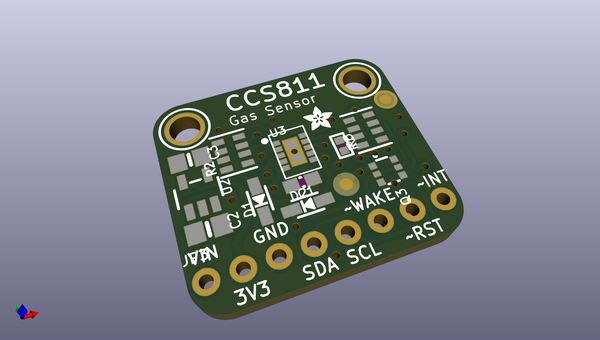
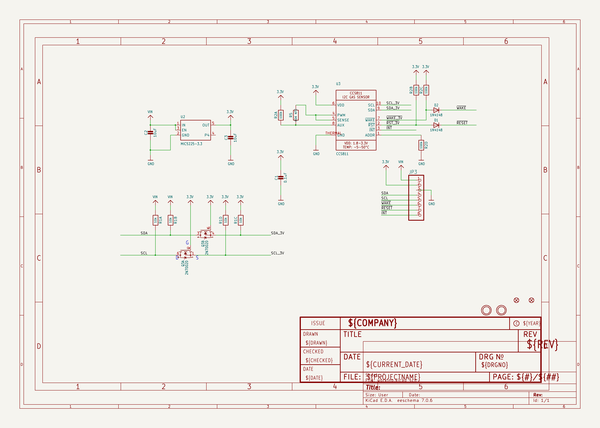
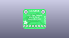
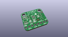
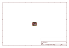
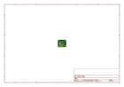
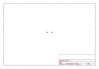
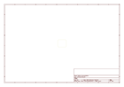
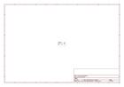

# OOMP Project  
## Adafruit-CCS811-Breakout-PCB  by adafruit  
  
oomp key: oomp_projects_flat_adafruit_adafruit_ccs811_breakout_pcb  
(snippet of original readme)  
  
-- Adafruit CCS811 Breakout PCB  
  
<a href="http://www.adafruit.com/products/3566">   
<a href="http://www.adafruit.com/products/3566">   
Click here to purchase one from the Adafruit shop</a>  
  
PCB files for the Adafruit CCS811 air quality sensor breakout board. Format is EagleCAD schematic and board layout  
  
For more details, check out the product page at  
* https://www.adafruit.com/products/3566  
  
--- Description  
  
Breathe easy - we finally have an I2C VOC/eCO2 sensor in the Adafruit shop! Add air quality monitoring to your project and with an Adafruit CCS811 Air Quality Sensor Breakout. This sensor from AMS is a gas sensor that can detect a wide range of Volatile Organic Compounds (VOCs) and is intended for indoor air quality monitoring. When connected to your microcontroller (running our library code) it will return a Total Volatile Organic Compound (TVOC) reading and an equivalent carbon dioxide reading (eCO2) over I2C. There is also an onboard thermistor that can be used to calculate the local ambient temperature.  
  
The CCS811 has a 'standard' hot-plate MOX sensor, as well as a small microcontroller that controls power to the plate, reads the analog voltage, and provides an I2C interface to read from.  
  
This part will measure eCO2 (equivalent calculated carbon-dioxide) concentration within a range of 400 to 8192 parts per million (ppm), and TVOC (Total Volatile Organic Compo  
  full source readme at [readme_src.md](readme_src.md)  
  
source repo at: [https://github.com/adafruit/Adafruit-CCS811-Breakout-PCB](https://github.com/adafruit/Adafruit-CCS811-Breakout-PCB)  
## Board  
  
  
## Schematic  
  
  
  
[schematic pdf](working_schematic.pdf)  
## Images  
  
  
  
  
  
  
  
  
  
  
  
  
  
  
  
  
