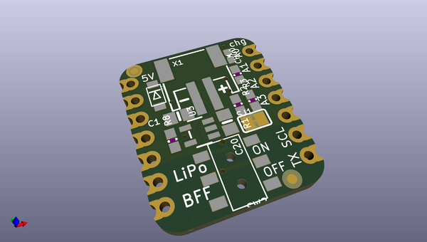
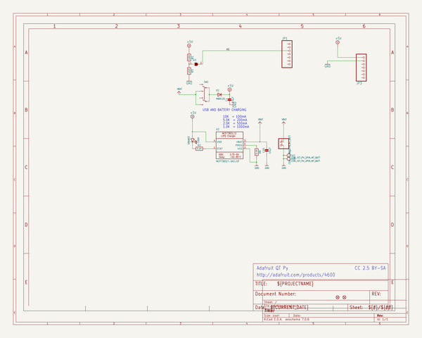
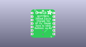
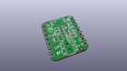
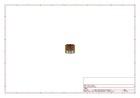
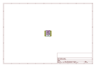
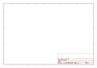
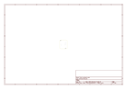
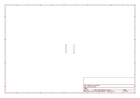
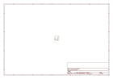

# OOMP Project  
## Adafruit-Charger-BFF-PCB  by adafruit  
  
oomp key: oomp_projects_flat_adafruit_adafruit_charger_bff_pcb  
(snippet of original readme)  
  
-- Adafruit Charger BFF for QT Py PCB  
  
<a href="http://www.adafruit.com/products/5397">   
Click here to purchase one from the Adafruit shop</a>  
  
PCB files for the Adafruit Charger BFF for QT Py.   
  
Format is EagleCAD schematic and board layout  
* https://www.adafruit.com/product/5397  
  
--- Description  
  
Is your QT Py all alone, lacking a friend to travel the wide world with? When you were a kid you may have learned about the "buddy" system, well this product is kinda like that! A board that will watch your QT Py's back and give it the power and support to wander out past your USB port.  
  
This little lipo charger is designed to fit onto the back of any QT Py board, and make it easy for portable powering. Simply plug any standard 3.7V/4.2V lithium polymer or lithium-ion rechargeable battery into the JST plug on the end. When powered by the USB port on the QT Py, the charger kicks in and will charge up the battery at 200mA max rate. You'll see the yellow LED light up when that happens.  
  
When the USB is removed, the battery will reverse charge into the 5V port via a Schottky diode. You can turn it on or off with the built in slide switch as well.  
  
A simple voltage divider on the cathode side of the diode and connected to pin A2 will let your firmware detect basic modes: if the voltage is over 4.3V, it is probably plugged into USB. If the voltage is 4.2V or below its probably running on the Lipoly battery and you can roughly determin  
  full source readme at [readme_src.md](readme_src.md)  
  
source repo at: [https://github.com/adafruit/Adafruit-Charger-BFF-PCB](https://github.com/adafruit/Adafruit-Charger-BFF-PCB)  
## Board  
  
  
## Schematic  
  
  
  
[schematic pdf](working_schematic.pdf)  
## Images  
  
  
  
  
  
  
  
  
  
  
  
  
  
  
  
  
