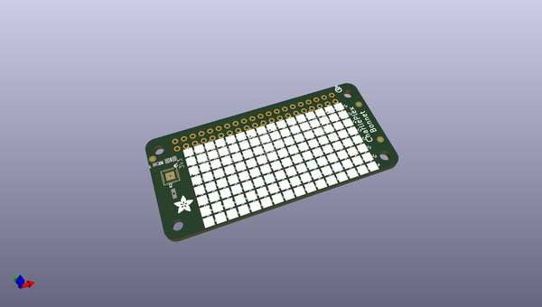
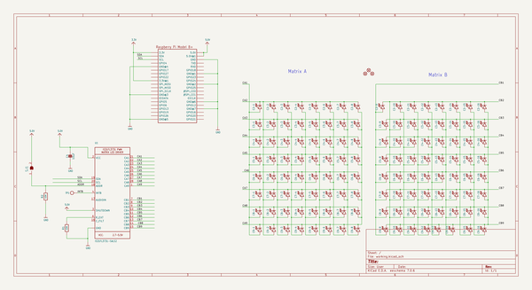
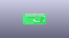
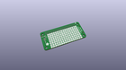
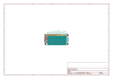
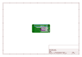
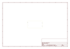
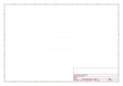
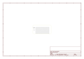

# OOMP Project  
## Adafruit-CharliePlex-Bonnet-PCBs  by adafruit  
  
(snippet of original readme)  
  
-- Adafruit CharliePlex LED Matrix Bonnet PCB  
  
<a href="http://www.adafruit.com/products/3467">   
Click here to purchase one from the Adafruit shop</a>  
  
PCB files for the Adafruit CharliePlex LED Matrix Bonnet.   
  
Format is EagleCAD schematic and board layout  
  
* https://www.adafruit.com/?q=charlieplex%20bonnet  
  
--- Description  
  
You won't be able to look away from the mesmerizing patterns created by this Adafruit CharliePlex LED Matrix Display Bonnet.  This 16x8 LED display can be placed atop any Raspberry Pi computer with a 2x20 connector, for a beautiful, bright grid of 128 charlieplexed LEDs. It even comes with a built-in charlieplex driver that is run over I2C.  
  
We carry these Bonnets in a [few vivid colors](https://www.adafruit.com/?q=charlieplex%20bonnet)  
  
What is particularly nice about this Wing is the I2C LED driver chip has the ability to PWM each individual LED in a 16x8 grid so you can have beautiful LED lighting effects, without a lot of pin twiddling. Simply tell the chip which LED on the grid you want lit, and what brightness and it's all taken care of for you. You get 8-bit (256 level) dimming for each individual LED.  
  
The IS31FL3731 is a nice little chip - and it runs happily over 3.3V power. Inside is enough RAM for 8 separate frames of display memory so you can set up multiple frames of an animation and flip them to be displayed with a single command. Since it uses I2C, it takes up only the SDA/SCL pins on   
  full source readme at [readme_src.md](readme_src.md)  
  
source repo at: [https://github.com/adafruit/Adafruit-CharliePlex-Bonnet-PCBs](https://github.com/adafruit/Adafruit-CharliePlex-Bonnet-PCBs)  
## Board  
  
  
## Schematic  
  
  
  
[schematic pdf](working_schematic.pdf)  
## Images  
  
  
  
  
  
  
  
  
  
  
  
  
  
  
  
  
