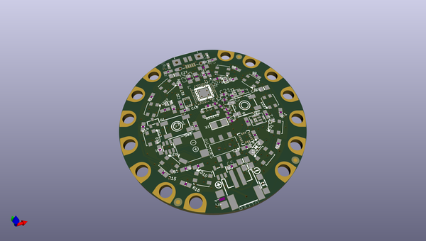
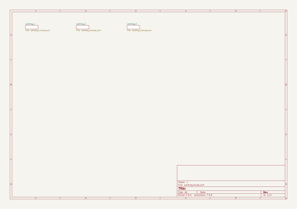

# OOMP Project  
## Adafruit-Circuit-Playground-Bluefruit-PCB  by adafruit  
  
(snippet of original readme)  
  
-- Adafruit Adafruit Circuit Playground Bluefruit PCB  
  
<a href="http://www.adafruit.com/products/4333">   
Click here to purchase one from the Adafruit shop</a>  
  
PCB files for the Adafruit Adafruit Circuit Playground Bluefruit.   
  
Format is EagleCAD schematic and board layout  
* https://www.adafruit.com/product/4333  
  
--- Description  
  
Circuit Playground Bluefruit is our third board in the Circuit Playground series, another step towards a perfect introduction to electronics and programming. We've taken the popular Circuit Playground Express and made it even better! Now the main chip is an nRF52840 microcontroller which is not only more powerful, but also comes with Bluetooth Low Energy support for wireless connectivity.  
  
The board is round and has alligator-clip pads around it so you don't have to solder or sew to make it work. You can power it from USB, a AAA battery pack, or with a Lipoly battery (for advanced users). Circuit Playground Bluefruit has built-in USB support. Built in USB means you plug it in to program it and it just shows up, no special cable or adapter required. Just program your code into the board then take it on the go!  
  
Here's some of the great goodies baked in to each Circuit Playground Bluefruit:  
  
* 1 x nRF52840 Cortex M4 processor with Bluetooth Low Energy support  
* 10 x mini NeoPixels, each one can display any color  
* 1 x Motion sensor (LIS3DH triple-axis accelerometer with tap detection, free-fall dete  
  full source readme at [readme_src.md](readme_src.md)  
  
source repo at: [https://github.com/adafruit/Adafruit-Circuit-Playground-Bluefruit-PCB](https://github.com/adafruit/Adafruit-Circuit-Playground-Bluefruit-PCB)  
## Board  
  
  
## Schematic  
  
  
  
[schematic pdf](working_schematic.pdf)  
## Images  
