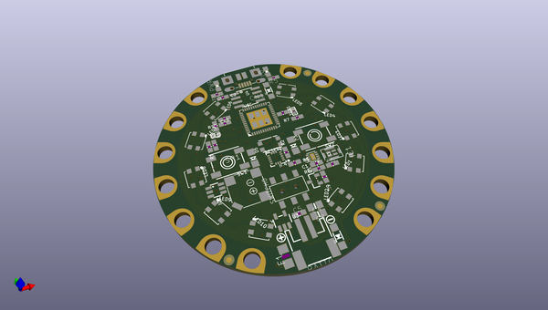
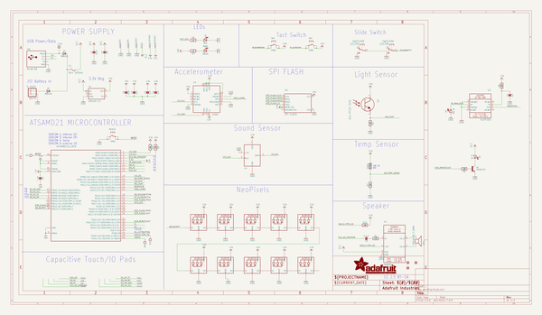
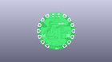
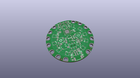
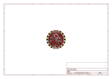
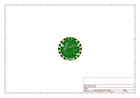
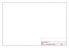
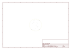
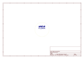
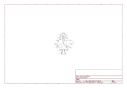

# OOMP Project  
## Adafruit-Circuit-Playground-Express-PCB  by adafruit  
  
oomp key: oomp_projects_flat_adafruit_adafruit_circuit_playground_express_pcb  
(snippet of original readme)  
  
-- Adafruit Circuit Playground Express PCB  
  
<a href="http://www.adafruit.com/products/3333">   
Click here to purchase one from the Adafruit shop</a>  
  
PCB files for the Adafruit Circuit Playground Express. Format is EagleCAD schematic and board layout  
  
For more details, check out the product page at  
* http://www.adafruit.com/products/3333  
  
--- Description  
  
Circuit Playground Express is the next step towards a perfect introduction to electronics and programming. We've taken the original Circuit Playground Classic and made it even better! Not only did we pack even more sensors in, we also made it even easier to program.  
  
Start your journey with Microsoft MakeCode block-based or Javascript programming. Then, you can use the same board to try CircuitPython, with the Python interpreter running right on the Express. As you progress, you can advance to using Arduino IDE, which has full support of all the hardware down to the low level, so you can make powerful projects.You can even use code.org CS Discoveries to learn all about coding right in your browser!  
  
Check out our detailed guide with a tour of Circuit Playground Express and details on getting started using MakeCode, CircuitPython, code.org CS Discoveries or Arduino!  
  
Because you can program the same board in 4 different ways - the Express has great value and re-usability. From beginners to experts, Circuit Playground Express has something for everyone. If you are looking fo  
  full source readme at [readme_src.md](readme_src.md)  
  
source repo at: [https://github.com/adafruit/Adafruit-Circuit-Playground-Express-PCB](https://github.com/adafruit/Adafruit-Circuit-Playground-Express-PCB)  
## Board  
  
  
## Schematic  
  
  
  
[schematic pdf](working_schematic.pdf)  
## Images  
  
  
  
  
  
  
  
  
  
  
  
  
  
  
  
  
