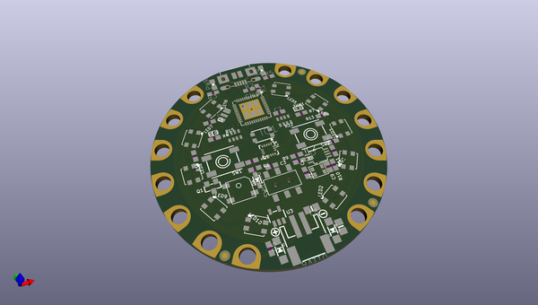
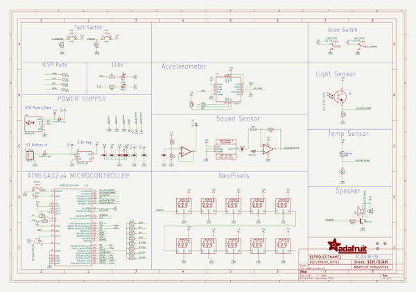
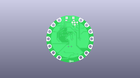
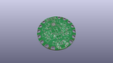
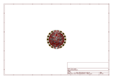
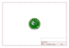
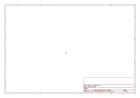
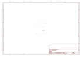
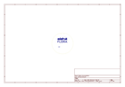
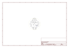

# OOMP Project  
## Adafruit-Circuit-Playground-PCB  by adafruit  
  
oomp key: oomp_projects_flat_adafruit_adafruit_circuit_playground_pcb  
(snippet of original readme)  
  
-- Adafruit Circuit Playground Classic PCB  
<a href="http://www.adafruit.com/products/3000">   
Click here to purchase one from the Adafruit shop</a>  
  
This is the Classic version of Circuit Playground, which comes with an ATmega32u4. It's designed to be used with Arduino IDE and code.org CS Discoveries only. It even comes with Firmata already programmed in, so you can use it immediately with code.org Discoveries without any preparation or updates.  
  
If you would like to use MakeCode or CircuitPython, check out [Circuit Playground Express](http://www.adafruit.com/products/3333), which can be used with MakeCode, CircuitPython or Arduino.  
  
Circuit Playground features an ATmega32u4 processor, just like our popular Flora. The board's also round and has alligator-clip pads around it so you don't have to solder or sew to make it work. You can power it from USB, a AAA battery pack, or with a Lipoly battery (for advanced users). Just program your code into the board then take it on the go!  
  
This is the PCB files for the Adafruit **Circuit Playground Classic** (not the Express). The format is EagleCAD schematic and board layout  
- http://www.adafruit.com/products/3000  
  
**The Circuit Playground Express can be found at http://www.adafruit.com/products/3333**  
  
--- License  
  
Adafruit invests time and resources providing this open source design, please support Adafruit and open-source hardware by purchasing products from [Adafruit](https://ww  
  full source readme at [readme_src.md](readme_src.md)  
  
source repo at: [https://github.com/adafruit/Adafruit-Circuit-Playground-PCB](https://github.com/adafruit/Adafruit-Circuit-Playground-PCB)  
## Board  
  
  
## Schematic  
  
  
  
[schematic pdf](working_schematic.pdf)  
## Images  
  
  
  
  
  
  
  
  
  
  
  
  
  
  
  
  
