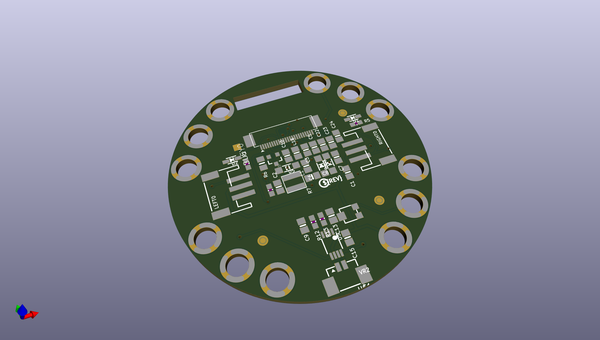
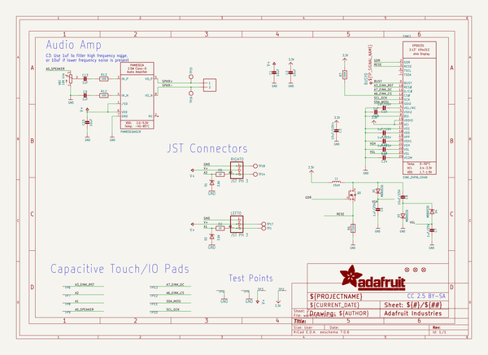
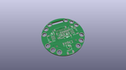
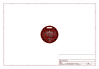
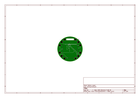
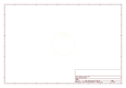
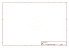
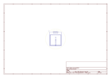
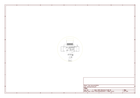

# OOMP Project  
## Adafruit-Circuit-Playground-Tri-Color-E-Ink-Gizmo-PCB  by adafruit  
  
(snippet of original readme)  
  
-- Adafruit Circuit Playgound Tri-Color E-Ink Gizmo PCB  
  
<a href="http://www.adafruit.com/products/4428">   
Click here to purchase one from the Adafruit shop</a>  
  
PCB files for the Adafruit Circuit Playground Tri-Color E-Ink Gizmo.   
  
Format is EagleCAD schematic and board layout  
* https://www.adafruit.com/product/4428  
  
--- Description  
  
Extend and expand your Circuit Playground projects with a bolt on E-Ink Gizmo that lets you add a lovely tri-color e-Ink display in a sturdy and reliable fashion. This PCB looks just like a round E-Ink breakout but has permanently affixed M3 standoffs that act as mechanical and electrical connections.  
  
Chances are you've seen one of those new-fangled 'e-readers' like the Kindle or Nook. They have gigantic electronic paper 'static' displays - that means the image stays on the display even when power is completely disconnected. The image is also high contrast and very daylight readable. It really does look just like printed paper!  
  
Once attached you'll get a 1.54" 152x152 display (black and red ink pixels and a white-ish background), two 3-pin STEMMA connectors for attaching NeoPixel strips or servos, and a Class D audio amplifier with a Molex PicoBlade connector that can plug one of our lil speakers.  
  
Using our CircuitPython or Arduino library, you can create a 'frame buffer' with what pixels you want to have activated and then write that out to the display. The library we wrote does all the w  
  full source readme at [readme_src.md](readme_src.md)  
  
source repo at: [https://github.com/adafruit/Adafruit-Circuit-Playground-Tri-Color-E-Ink-Gizmo-PCB](https://github.com/adafruit/Adafruit-Circuit-Playground-Tri-Color-E-Ink-Gizmo-PCB)  
## Board  
  
  
## Schematic  
  
  
  
[schematic pdf](working_schematic.pdf)  
## Images  
  
  
  
  
  
  
  
  
  
  
  
  
  
  
  
  
