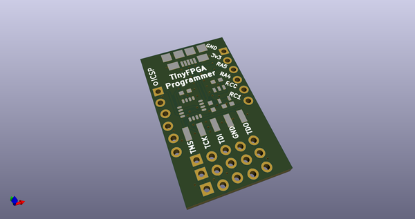
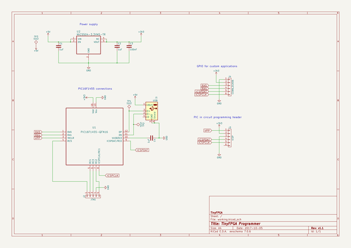
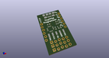
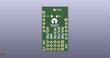
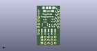

# OOMP Project  
## Adafruit_CircuitPython_JTAG  by adafruit  
  
oomp key: oomp_projects_flat_adafruit_adafruit_circuitpython_jtag  
(snippet of original readme)  
  
- TinyFPGA Programmer  
The TinyFPGA Programmer is a very simple USB-JTAG bridge designed to  
program bitstreams onto TinyFPGA A1 and A2 boards.  
  
-- Serial Protocol  
The programmer firmware appears as a generic USB serial port when you connect it  
to a computer.  Control of the GPIO pins on the programmer is through this simple  
serial interface.  
  
--- Command Format  
Commands are encoded as 8-bit bytes with a command type field and data payload.  
The payload is typically a 6-bit bitmap representing the GPIO pins of the programmer.  
  
|      7:6     | 5 | 4 | 3 | 2 | 1 | 0 |  
|--------------|---|---|---|---|---|---|  
| Command Type |TMS|TCK|TDI|TDO|RC1|RC0|  
  
--- Commands  
  
|Opcode |             Command           |  
|-------|-------------------------------|  
|   0   | Configure Input/Output        |  
|   1   | Extended Command (Unused)     |  
|   2   | Set Outputs                   |  
|   3   | Set Outputs and Sample Inputs |  
  
---- Configure Input/Output  
For each of the GPIO pins, set the direction of the pin.  
* 1: Set GPIO pin n to INPUT  
* 0: Set GPIO pin n to OUTPUT  
  
---- Extended Command  
Reserved for future command expansion.  
  
---- Set Outputs  
Set each of the output pins to the given values.  
  
---- Set Outputs and Sample Inputs  
Set each of the output pins to the given values and return a byte representing  
the current values of the input pins.  
  
--- General Usage  
For serial interfaces like JTAG this protocol divides the maximum possible bandwidth  
by 8 from the USB to JTAG interface.  This means   
  full source readme at [readme_src.md](readme_src.md)  
  
source repo at: [https://github.com/adafruit/Adafruit_CircuitPython_JTAG](https://github.com/adafruit/Adafruit_CircuitPython_JTAG)  
## Board  
  
  
## Schematic  
  
  
  
[schematic pdf](working_schematic.pdf)  
## Images  
  
  
  
  
  
  
