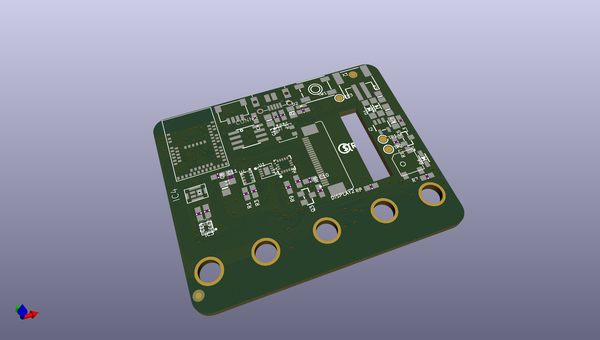
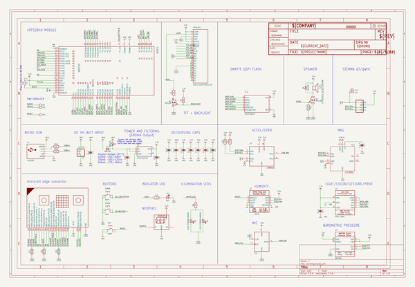
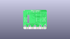
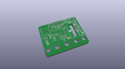
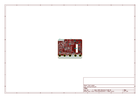
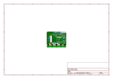
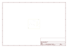
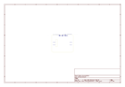
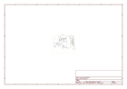

# OOMP Project  
## Adafruit-CLUE-PCB  by adafruit  
  
(snippet of original readme)  
  
-- Adafruit CLUE nRF52840 Express PCB  
  
<a href="http://www.adafruit.com/products/4500">   
Click here to purchase one from the Adafruit shop</a>  
  
PCB files for the Adafruit CLUE nRF52840 Express.   
  
Format is EagleCAD schematic and board layout  
* https://www.adafruit.com/product/4500  
  
--- Description  
  
Do you feel like you just don't have a CLUE? Well, we can help with that - get a CLUE here at Adafruit by picking up this sensor-packed development board. We wanted to build some projects that have a small screen and a lot of sensors. To make it compatible with existing projects, we made it the same shape and size as the BBC micro:bit and with the same edge-connector on the bottom with 5 big pads so it will fit into your existing robot kit or 'bit add-on. This is the alpha release of the hardware.  
  
While the CLUE looks a bit like a 'bit it has totally redesigned-from-scratch technology:  
  
* Nordic nRF52840 Bluetooth LE processor - 1 MB of Flash, 256KB RAM, 64 MHz Cortex M4 processor  
* 1.3″ 240×240 Color IPS TFT display for high resolution text and graphics  
* Power it from any 3-6V battery source (internal regulator and protection diodes)  
* Two A / B user buttons and one reset button  
* Tons of sensors!  
  * ST Micro series 9-DoF motion - LSM6DS33 Accel/Gyro + LIS3MDL magnetometer  
  * APDS9960 Proximity, Light, Color, and Gesture Sensor  
  * PDM Microphone sound sensor  
  * SHT Humidity  
  * BMP280 temperature and barometric pressure/a  
  full source readme at [readme_src.md](readme_src.md)  
  
source repo at: [https://github.com/adafruit/Adafruit-CLUE-PCB](https://github.com/adafruit/Adafruit-CLUE-PCB)  
## Board  
  
  
## Schematic  
  
  
  
[schematic pdf](working_schematic.pdf)  
## Images  
  
  
  
  
  
  
  
  
  
  
  
  
  
  
  
  
