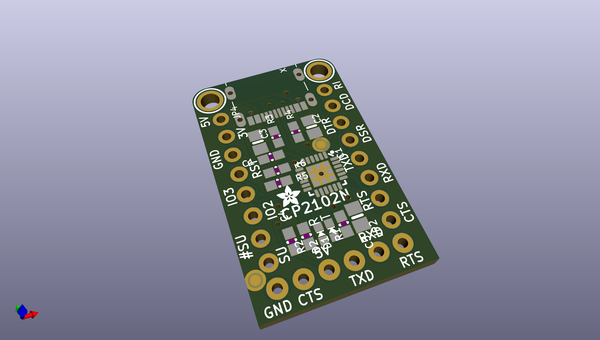
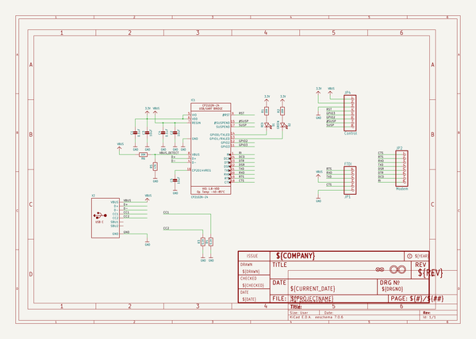
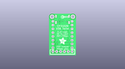
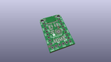
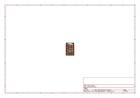
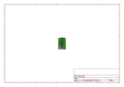
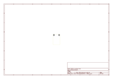
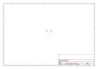
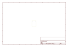
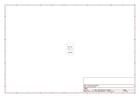

# OOMP Project  
## Adafruit-CP2102N-Friend-PCB  by adafruit  
  
oomp key: oomp_projects_flat_adafruit_adafruit_cp2102n_friend_pcb  
(snippet of original readme)  
  
-- Adafruit CP2102N Friend - USB to Serial Converter PCB  
  
<a href="http://www.adafruit.com/products/5335">   
Click here to purchase one from the Adafruit shop</a>  
  
PCB files for the Adafruit CP2102N Friend - USB to Serial Converter.   
  
Format is EagleCAD schematic and board layout  
* https://www.adafruit.com/product/5335  
  
--- Description  
  
  
Long gone are the days of parallel ports and serial ports. Now the USB port reigns supreme! But USB is hard, and you just want to transfer your every-day serial data from a microcontroller to computer. What now? Enter the Adafruit CP2102N Friend!  
  
The CP2102N is very similar to the CP2104. Despite having a name with a lower number, its actually considered the successor/next generation to the CP2104. Compared to the CP2104, the CP2102N can:  
  
* Transfer data at a faster rate: CP2104 is 2Mbps max, the CP2102N is 3Mbps max  
Reprogram the internal settings: CP2104 has a one-time-programmable memory and the CP2102N has reprogrammable settings memory. 99% of people don't use this capability but it is there if you need it.  
* The CP2102N improves over the CP2012 (no N) by having the same RS-485 and GPIO support that the CP2104 has  
* More details in the SiLabs CP2104 to CP2102N migration guide.  
* We've also updated this breakout from our CP2104 Friend so that it has USB C instead of Micro B. It is otherwise 'drop in compatible' and anywhere you would use the CP2104 for uploading firmware to microcontr  
  full source readme at [readme_src.md](readme_src.md)  
  
source repo at: [https://github.com/adafruit/Adafruit-CP2102N-Friend-PCB](https://github.com/adafruit/Adafruit-CP2102N-Friend-PCB)  
## Board  
  
  
## Schematic  
  
  
  
[schematic pdf](working_schematic.pdf)  
## Images  
  
  
  
  
  
  
  
  
  
  
  
  
  
  
  
  
