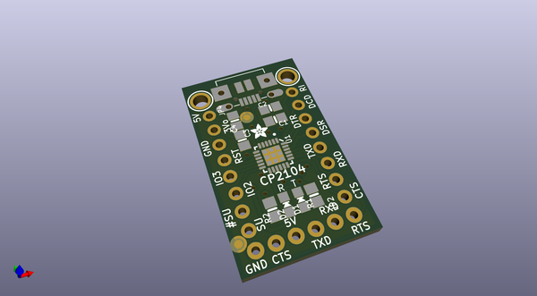
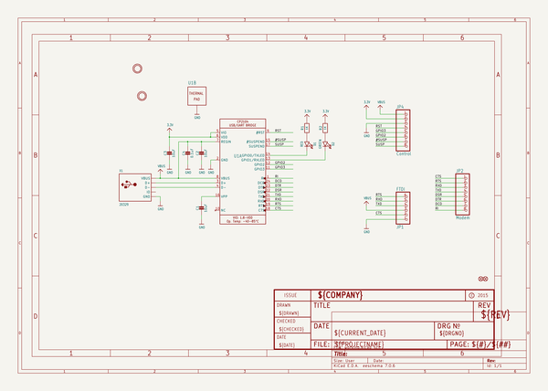
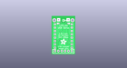
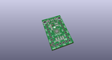
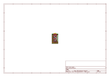
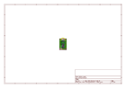
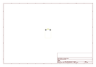
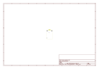
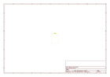
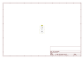

# OOMP Project  
## Adafruit-CP2104-Friend-PCB  by adafruit  
  
(snippet of original readme)  
  
-- Adafruit CP2104 Friend PCB  
  
<a href="http://www.adafruit.com/products/3309">   
Click here to purchase one from the Adafruit shop</a>  
  
PCB files for the Adafruit CP2104 Friend. Format is EagleCAD schematic and board layout  
* https://www.adafruit.com/product/3309  
  
--- Description  
  
Long gone are the days of parallel ports and serial ports. Now the USB port reigns supreme! But USB is hard, and you just want to transfer your every-day serial data from a microcontroller to computer. What now? Enter the Adafruit CP2104 Friend!  
  
This is a high-quality CP2104 USB-Serial chip that can upload code at a blistering 2Mbit/s for fast development time. It also has auto-reset for Arduino/ATmega328 boards so no noodling with pins and reset button pressings. The CP2104 has better driver support than the CH340 and can do very high speeds, and variable speeds without stability issues. Compared to the FT232RL and FT231X, the CP2104 has the same capabilities or better, at a great price! It even has the RX/TX LEDs to help you debug your data, they'll blink when the chip receives/transmits data.  
  
By default, we've set it up so that it matches our FTDI cables. The 6th pin is RTS, the power wire is +5V and the signal levels are 3.3V (they are 5V compliant, and should work in the vast majority of 3.3V and 5V signal systems). Works excellently with any Arduino, ESP8266, ESP32 or any other microcontroller that uses an 'FTDI port' for communications   
  full source readme at [readme_src.md](readme_src.md)  
  
source repo at: [https://github.com/adafruit/Adafruit-CP2104-Friend-PCB](https://github.com/adafruit/Adafruit-CP2104-Friend-PCB)  
## Board  
  
  
## Schematic  
  
  
  
[schematic pdf](working_schematic.pdf)  
## Images  
  
  
  
  
  
  
  
  
  
  
  
  
  
  
  
  
