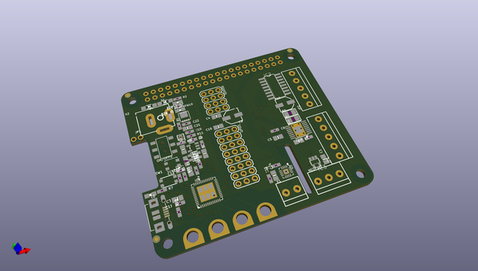

# OOMP Project  
## Adafruit_Crickit_PCBs  by adafruit  
  
(snippet of original readme)  
  
- Adafruit_Crickit_PCBs  
PCB files for the Adafruit Crickit Boards  
  
Format is EagleCAD schematic and board layout  
  
For more details, check out the product pages at  
  
   * http://www.adafruit.com/products/3093 (circuit playground)  
   * http://www.adafruit.com/products/3343 (feather)  
   * https://www.adafruit.com/product/3928 (microbit)  
   * https://www.adafruit.com/product/3957 (HAT)  
  
Adafruit invests time and resources providing this open source design,   
please support Adafruit and open-source hardware by purchasing   
products from Adafruit!  
  
Designed by Adafruit Industries.    
Creative Commons Attribution, Share-Alike license, check license.txt for more information  
All text above must be included in any redistribution  
  full source readme at [readme_src.md](readme_src.md)  
  
source repo at: [https://github.com/adafruit/Adafruit_Crickit_PCBs](https://github.com/adafruit/Adafruit_Crickit_PCBs)  
## Board  
  
  
## Schematic  
  
  
  
[schematic pdf](working_schematic.pdf)  
## Images  
