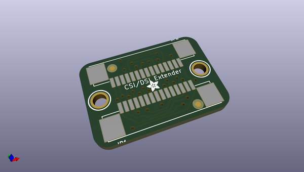
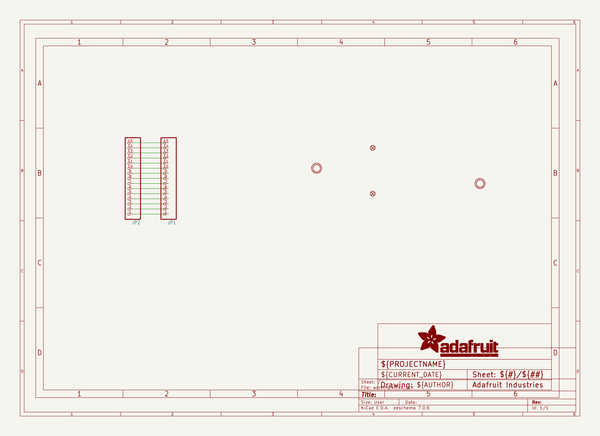
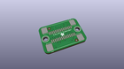
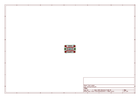
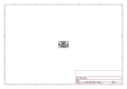
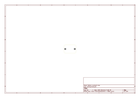
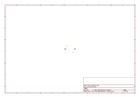
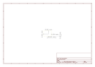

# OOMP Project  
## Adafruit-CSI-or-DSI-Cable-Extender-Thingy-for-Raspberry-Pi  by adafruit  
  
oomp key: oomp_projects_flat_adafruit_adafruit_csi_or_dsi_cable_extender_thingy_for_raspberry_pi  
(snippet of original readme)  
  
-- Adafruit CSI or DSI Cable Extender Thingy for Raspberry Pi PCB  
  
<a href="http://www.adafruit.com/products/3671">   
Click here to purchase one from the Adafruit shop</a>  
  
Thingy! Extender! Format is EagleCAD schematic and board layout  
  
For more details, check out the product page at  
* http://www.adafruit.com/product/3671  
  
--- Description  
  
Every time someone posts on the Adafruit forums and says they need to have a really long cable for their Pi Camera (CSI) or Pi Display (DSI), we say, "Oh you mean like some sort of CSI/DSI cable extender thingy? Yeah we don't have one of those in stock yet" But that time is over! Now we can say, "Yes we have a CSI/DSI Cable Extender Thingy in stock!" And we point them here.  
  
This Thingy is very simple, it lets you connect two 15-pin 1.0mm pitch cables end-to-end and extend the length. It does the funky pin rearranging and all for you, so just snap those two cables in. Carefully pry the two ears of the connectors, plug the cables with contacts pointing up, and then push the ears back in for a solid connection.  
  
In theory, the CSI/DSI interface isn't meant for super long cables, and you're not supposed to extend them. But we laugh in the face of theory. We connected two 1 meter long extension cables using this Thingy and our Display and Camera worked! But, just so you know, it's really not guaranteed: CSI/DSI are meant for maybe 25cm max length.  
  
For use with classic 15-pin 1.0mm pitch fl  
  full source readme at [readme_src.md](readme_src.md)  
  
source repo at: [https://github.com/adafruit/Adafruit-CSI-or-DSI-Cable-Extender-Thingy-for-Raspberry-Pi](https://github.com/adafruit/Adafruit-CSI-or-DSI-Cable-Extender-Thingy-for-Raspberry-Pi)  
## Board  
  
  
## Schematic  
  
  
  
[schematic pdf](working_schematic.pdf)  
## Images  
  
  
  
  
  
  
  
  
  
  
  
  
  
  
  
  
