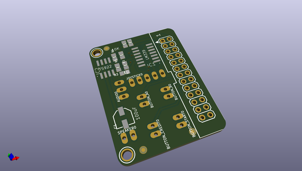
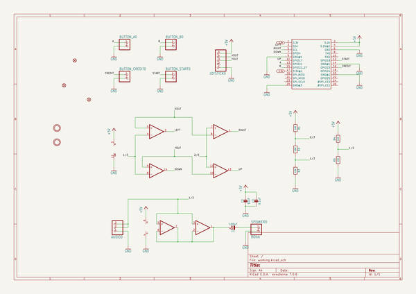
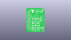
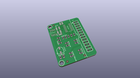
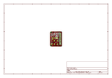
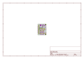
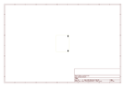
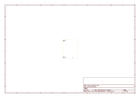
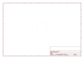
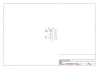

# OOMP Project  
## Adafruit-Cupcade-Adapter-PCB  by adafruit  
  
oomp key: oomp_projects_flat_adafruit_adafruit_cupcade_adapter_pcb  
(snippet of original readme)  
  
-- Adafruit Cupcade Arcade Adapter V1 PCB  
<a href="http://www.adafruit.com/products/1916">   
Click here to purchase one from the Adafruit shop</a>  
  
This is the PCB and small parts pack from original V1 Cupcade. These parts were used with the original "Raspberry Pi 1" design, not the version for Pi A+, 2, 3, or Zero!  
  
Great for anyone who needs a replacement PCB or wants to mod or build out their Cupcade.   
  
PCB files for the Adafruit Cupcade Adapter. The format is EagleCAD schematic and board layout  
- http://www.adafruit.com/product/1916  
  
--- License  
  
Adafruit invests time and resources providing this open source design, please support Adafruit and open-source hardware by purchasing products from [Adafruit](https://www.adafruit.com)!  
  
All text above must be included in any redistribution  
  
Designed by Limor Fried/Ladyada for Adafruit Industries.  
Creative Commons Attribution/Share-Alike, all text above must be included in any redistribution.   
See license.txt for additional information.  
  
  full source readme at [readme_src.md](readme_src.md)  
  
source repo at: [https://github.com/adafruit/Adafruit-Cupcade-Adapter-PCB](https://github.com/adafruit/Adafruit-Cupcade-Adapter-PCB)  
## Board  
  
  
## Schematic  
  
  
  
[schematic pdf](working_schematic.pdf)  
## Images  
  
  
  
  
  
  
  
  
  
  
  
  
  
  
  
  
