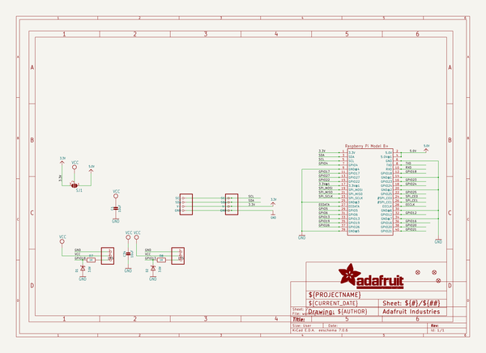
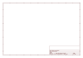

# OOMP Project  
## Adafruit-CYBERDECK-PCB  by adafruit  
  
(snippet of original readme)  
  
-- Adafruit CYBERDECK HAT and Bonnet for Raspberry Pi PCB  
  
<a href="http://www.adafruit.com/products/4863">   
<a href="http://www.adafruit.com/products/4862">   
Click here to purchase one from the Adafruit shop</a>  
  
PCB files for the Adafruit CYBERDECK HAT and Bonnet for Raspberry Pi.   
  
Format is EagleCAD schematic and board layout  
* https://www.adafruit.com/product/4863  
  
--- Description  
  
Cyber-warriors, listen up here! We’ve got with some zero-day unreleased hardware we just dumpster-dived. Now you can crack kodes, and write skripts with style, thanks to the CYBERDECK HAT and Bonnet for Raspberry Pi 400 from Adafruit zaibatsu.  
  
This is the same hardware Kevin Mitnick used when he popped Sidewinder! Ok, maybe not, but it will definitely let you create a stand-alone Kali deck by plugging in one of our many display HATs. We also give you some STEMMA / STEMMA QT plugs to glam up your rig with NeoPixels, servos, or sensors! (STEMMA cables sold separately)  
  
Comes completely pre-assembled and tested so you don't need to do anything but plug it in. Works best with the Pi 400 computer.  
  
--- License  
  
Adafruit invests time and resources providing this open source design, please support Adafruit and open-source hardware by purchasing products from [Adafruit](https://www.adafruit.com)!  
  
Designed by Limor Fried/Ladyada for Adafruit Industries.  
  
Creative Commons Attribution/Share-Alike  
  full source readme at [readme_src.md](readme_src.md)  
  
source repo at: [https://github.com/adafruit/Adafruit-CYBERDECK-PCB](https://github.com/adafruit/Adafruit-CYBERDECK-PCB)  
## Board  
  
  
## Schematic  
  
  
  
[schematic pdf](working_schematic.pdf)  
## Images  
  
  
  
  
  
  
  
  
  
  
  
  
  
  
  
  
