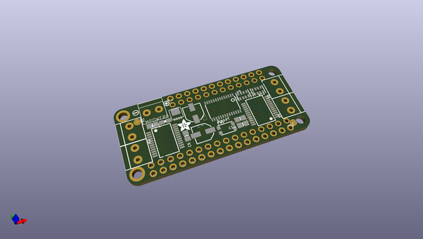
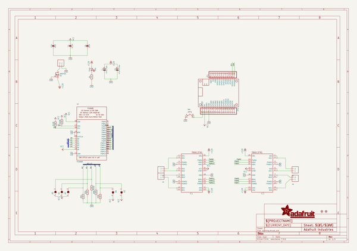
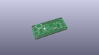
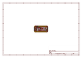
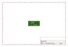
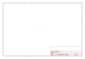
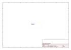
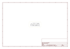

# OOMP Project  
## Adafruit-DC-Stepper-Motor-FeatherWing-PCB  by adafruit  
  
(snippet of original readme)  
  
-- Adafruit DC Stepper Motor FeatherWing PCB  
<a href="http://www.adafruit.com/products/2927">   
Click here to purchase one from the Adafruit shop</a>  
  
This is the DC Motor + Stepper FeatherWing which will let you use 2 x bi-polar stepper motors or 4 x brushed DC motors (or 1 stepper and 2 DC motors). Using our Feather Stacking Headers or Feather Female Headers you can connect a FeatherWing on top or bottom of your Feather board and let the board take flight!  
  
The original Adafruit Motorshield Kit is one of our most beloved kits, which is why we decided to squish it all together on a FeatherWing to make something even smaller, lighter, and more portable! Instead of using a latch and the Arduino's PWM pins, we have a fully-dedicated PWM driver chip onboard. This chip handles all the motor and speed controls over I2C.  
  
PCB files for Adafruit DC Stepper Motor FeatherWing. The format is EagleCAD schematic and board layout  
- https://www.adafruit.com/products/2927  
  
--- License  
  
Adafruit invests time and resources providing this open source design, please support Adafruit and open-source hardware by purchasing products from [Adafruit](https://www.adafruit.com)!  
  
All text above must be included in any redistribution  
  
Designed by Limor Fried/Ladyada for Adafruit Industries.  
Creative Commons Attribution/Share-Alike, all text above must be included in any redistribution.   
See license.txt for additional information.  
  
  full source readme at [readme_src.md](readme_src.md)  
  
source repo at: [https://github.com/adafruit/Adafruit-DC-Stepper-Motor-FeatherWing-PCB](https://github.com/adafruit/Adafruit-DC-Stepper-Motor-FeatherWing-PCB)  
## Board  
  
  
## Schematic  
  
  
  
[schematic pdf](working_schematic.pdf)  
## Images  
  
  
  
  
  
  
  
  
  
  
  
  
  
  
  
  
