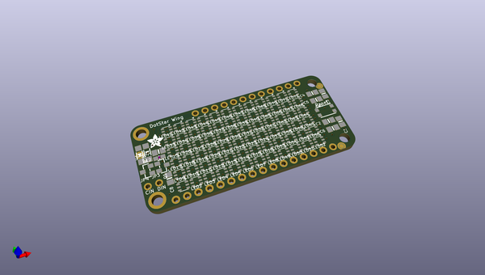
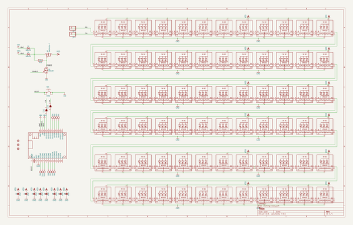
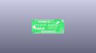
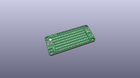
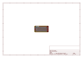
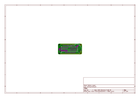
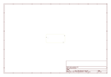
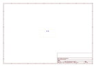
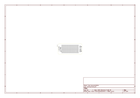

# OOMP Project  
## Adafruit-DotStar-FeatherWing-PCB  by adafruit  
  
oomp key: oomp_projects_flat_adafruit_adafruit_dotstar_featherwing_pcb  
(snippet of original readme)  
  
-- Adafruit DotStar FeatherWing PCB  
  
<a href="http://www.adafruit.com/products/3449">   
Click here to purchase one from the Adafruit shop</a>  
  
PCB files for the Adafruit DotStar FeatherWing. Format is EagleCAD schematic and board layout  
  
For more details, check out the product page at  
* http://www.adafruit.com/products/3449  
  
--- Description  
  
A Feather board without ambition is a Feather board without FeatherWings! This is the DotStar FeatherWing, a 6x12 RGB LED Add-on For All Feather Boards! Using our Feather Stacking Headers or Feather Female Headers you can connect a FeatherWing on top or bottom of your Feather board and make your Feather board strut like a peacock at a rave.  
  
Put on your sunglasses before staring into these 72 configurable RGB LEDs, they are super bright! Arranged in a 6x12 matrix, each 2mm by 2mm sized RGB pixel is individually addressable. Only two pins are required to control all the LEDs. On the bottom we have jumpers for the Data and Clock lines so you can change them from the defaults. Works with any/all of our Feathers! You can cut the default jumper traces and use any pins you like  
  
To make it easy to start, the LEDs are by default powered from either the USB power line or Battery power line, whichever is higher. Two Schottky diodes are used to switch between the two. This power arrangement is able to handle 1 Amp of constant current draw and maybe 2A peak, so not a good way to make a flashlight  
  full source readme at [readme_src.md](readme_src.md)  
  
source repo at: [https://github.com/adafruit/Adafruit-DotStar-FeatherWing-PCB](https://github.com/adafruit/Adafruit-DotStar-FeatherWing-PCB)  
## Board  
  
  
## Schematic  
  
  
  
[schematic pdf](working_schematic.pdf)  
## Images  
  
  
  
  
  
  
  
  
  
  
  
  
  
  
  
  
