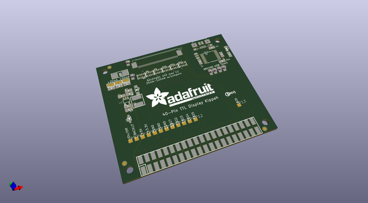
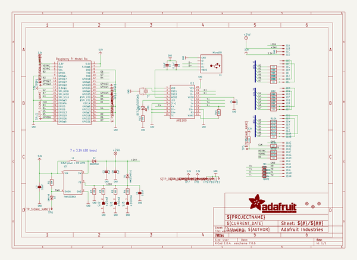
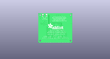
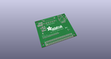
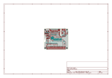
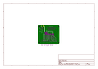
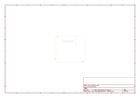
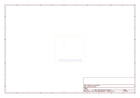
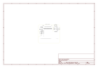

# OOMP Project  
## Adafruit-DPI-Kippah-PCB  by adafruit  
  
(snippet of original readme)  
  
-- Adafruit DPI Kippah PCB  
  
&nbsp;   
   
Click the image or links below to go to a specific product in the Adafruit shop.  
  
PCB files for the Adafruit Adafruit DPI Display Kippah for Raspberry PI. Format is EagleCAD schematic and board layout  
* TFT & Resistive Touch support https://www.adafruit.com/product/2453  
* TFT Display Support Only https://www.adafruit.com/product/2454  
  
--- DESCRIPTION  
A TFT panel connected to a Raspberry Pi without the use of an HDMI decoder? What is this sorcery??? It's the DPI Kippah from Adafruit! This HAT-like* board snaps onto a Raspberry Pi B+, A+, Pi 2, Pi 3 or Zero and with a little software configuration, allows you to have what normally would go out the HDMI port come up on a nice little flat screen. *Its not technically a HAT due to the lack of an on-board EEPROM, but its the same shape as a Pi HAT and its a covering of sorts, so we call it a kippah  
  
This is the Kippah with resistive touch support. If you don't need a touchscreen then here's our super low-cost version of the Kippah without the USB touchscreen capability.  
  
Compared to our lovely HDMI backpacks, you don't have the extra cost or expense of an HDMI encoder/decoder. And you get a nice ultra-fast 18-bit color display with optional touch support. We tested it and it works great wit  
  full source readme at [readme_src.md](readme_src.md)  
  
source repo at: [https://github.com/adafruit/Adafruit-DPI-Kippah-PCB](https://github.com/adafruit/Adafruit-DPI-Kippah-PCB)  
## Board  
  
  
## Schematic  
  
  
  
[schematic pdf](working_schematic.pdf)  
## Images  
  
  
  
  
  
  
  
  
  
  
  
  
  
  
  
  
