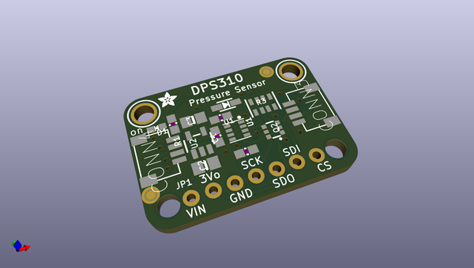
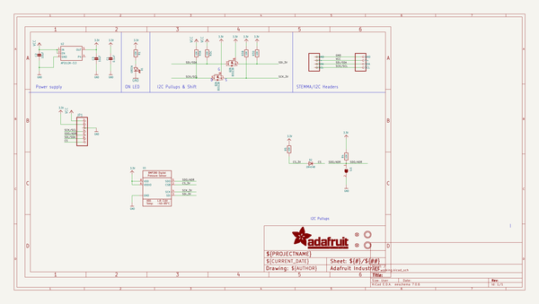
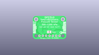
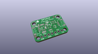
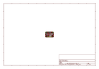
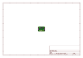
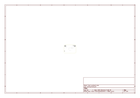
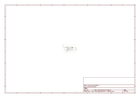

# OOMP Project  
## Adafruit-DPS310-PCB  by adafruit  
  
oomp key: oomp_projects_flat_adafruit_adafruit_dps310_pcb  
(snippet of original readme)  
  
-- Adafruit DPS310 Precision Barometric Pressure and Altitude Sensor PCB  
  
<a href="http://www.adafruit.com/products/4494">   
Click here to purchase one from the Adafruit shop</a>  
  
PCB files for the Adafruit DPS310 Precision Barometric Pressure and Altitude Sensor.   
  
Format is EagleCAD schematic and board layout  
* https://www.adafruit.com/product/4494  
  
--- Description  
  
How high are you right now? If you had a precision altitude sensor, you would know for sure! The DPS310 sensor from Infineon a high precision barometric sensor, perfect for measuring altitude changes with a up to ±0.002 hPa (or ±0.02 m) precision high precision mode and ± 1 hPa absolute accuracy. That means you can know your absolute altitude with 1 meter accuracy when you set the sea-level pressure, and measure changes in altitude with up to 2 cm precision. This makes it a great sensor for use in drones or other altitude-sensitive robots. This sensor would also do well in any environmental sensing kit, you can use it to predict weather system changes  
  
You can use this sensor with either I2C or SPI, so its easy to integrate. It also has a temperature sensor built in with ± 0.5°C accuracy. For the lowest noise readings, set it up to take multiple measurements and perform a low-pass filter, that capability is built in! You can use it from 300 to 1200 hPa and in ambient temperature ranges from -40 to 85 °C.  
  
To make life easier so you can focus on your important   
  full source readme at [readme_src.md](readme_src.md)  
  
source repo at: [https://github.com/adafruit/Adafruit-DPS310-PCB](https://github.com/adafruit/Adafruit-DPS310-PCB)  
## Board  
  
  
## Schematic  
  
  
  
[schematic pdf](working_schematic.pdf)  
## Images  
  
  
  
  
  
  
  
  
  
  
  
  
  
  
  
  
