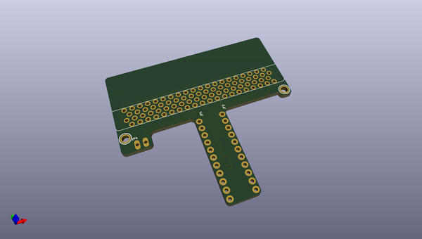
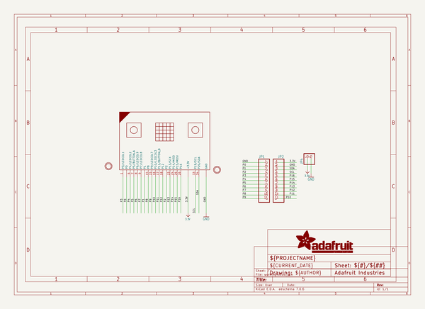
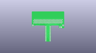
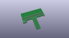
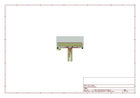
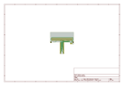
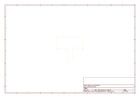
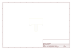

# OOMP Project  
## Adafruit-DragonTail-for-micro-bit-PCB  by adafruit  
  
(snippet of original readme)  
  
-- Adafruit DragonTail for micro:bit breadboard pin breakout PCB  
  
<a href="http://www.adafruit.com/products/3695">   
Click here to purchase one from the Adafruit shop</a>  
  
PCB files for the Adafruit DragonTail for micro:bit. Format is EagleCAD schematic and board layout  
  
For more details, check out the product page at  
* https://www.adafruit.com/products/3695  
  
--- Description  
  
The BBC micro:bit is a cute, all-in-one learning board, with LEDs, sensors, and even a Bluetooth LE radio built in. What it doesn't have is a set of 0.1" headers, for breadboard compatibility. Instead, there's a PCB 'card edge' connector that can slot into a matching socket. Now, if you want to hook up a servo, some NeoPixels, or some other simple component, you could use our alligator-to-header cables, and that will let you connect one or two parts to the power and P0, P1 or P2 pads. But...those alligator clips can slip around, and you don't get access to some of the more fun i/o pins, like I2C.  
  
So, we made the Adafruit DragonTail for micro:bit. This breakout board has the card-edge connector for your micro:bit, and then breaks out all the pads so that it can be plugged in to any solderless breadboard. You even get two pads for the power railing! It comes fully assembled - no soldering required. And every pad is clearly labeled: by name, if it has an analog input, and when it is shared with the LED matrix.  
  
--- License  
  
Adafruit invests time and res  
  full source readme at [readme_src.md](readme_src.md)  
  
source repo at: [https://github.com/adafruit/Adafruit-DragonTail-for-micro-bit-PCB](https://github.com/adafruit/Adafruit-DragonTail-for-micro-bit-PCB)  
## Board  
  
  
## Schematic  
  
  
  
[schematic pdf](working_schematic.pdf)  
## Images  
  
  
  
  
  
  
  
  
  
  
  
  
  
  
  
  
