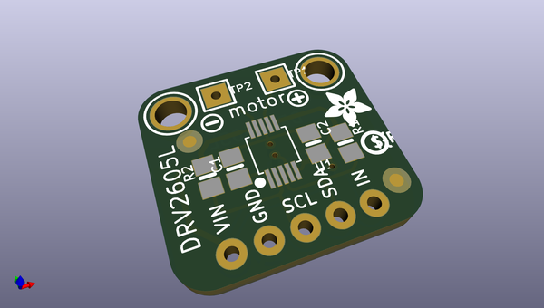
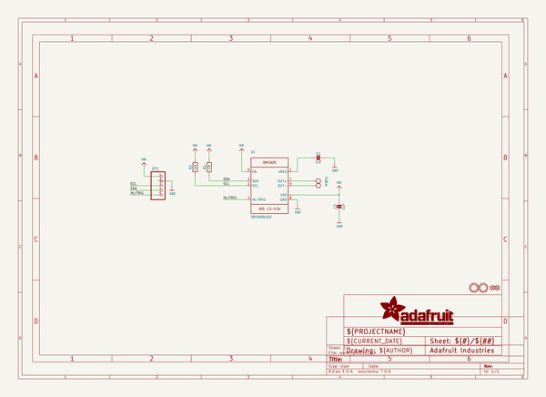
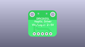
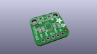
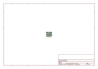
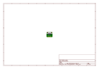
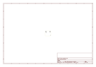
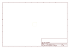
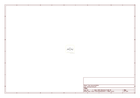

# OOMP Project  
## Adafruit-DRV2605-PCB  by adafruit  
  
oomp key: oomp_projects_flat_adafruit_adafruit_drv2605_pcb  
(snippet of original readme)  
  
- Adafruit DRV2605 Haptic Motor Controller PCB  
<a href="http://www.adafruit.com/products/2305">   
Click here to purchase one from the Adafruit shop</a>  
  
The DRV2605 from TI is a fancy little motor driver. Rather than controlling a stepper motor or DC motor, its designed specifically for controlling haptic motors - buzzers and vibration motors. Normally one would just turn those kinds of motors on and off, but this driver has the ability to have various effects when driving a vibe motor. For example, ramping the vibration level up and down, 'click' effects, different buzzer levels, or even having the vibration follow a musical/audio input.  
  
PCB files for Adafruit DRV2605 Haptic Motor Driver. The format is EagleCAD schematic and board layout  
- https://www.adafruit.com/product/2305  
  
--- License  
  
Adafruit invests time and resources providing this open source design, please support Adafruit and open-source hardware by purchasing products from [Adafruit](https://www.adafruit.com)!  
  
All text above must be included in any redistribution  
  
Designed by Limor Fried/Ladyada for Adafruit Industries.  
Creative Commons Attribution/Share-Alike, all text above must be included in any redistribution.   
See license.txt for additional information.  
  
  full source readme at [readme_src.md](readme_src.md)  
  
source repo at: [https://github.com/adafruit/Adafruit-DRV2605-PCB](https://github.com/adafruit/Adafruit-DRV2605-PCB)  
## Board  
  
  
## Schematic  
  
  
  
[schematic pdf](working_schematic.pdf)  
## Images  
  
  
  
  
  
  
  
  
  
  
  
  
  
  
  
  
