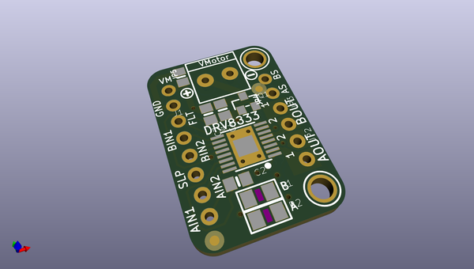
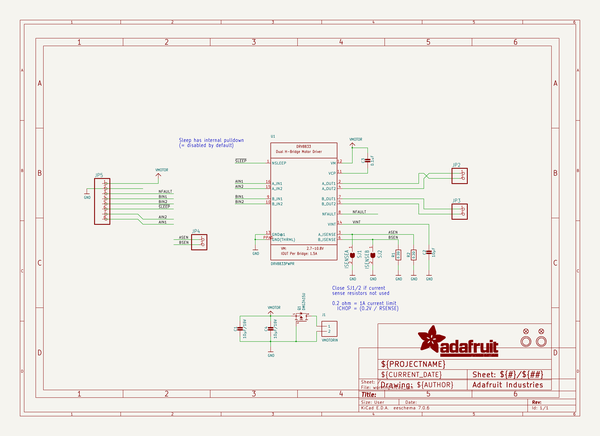
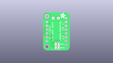
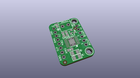
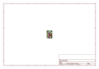
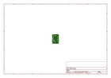
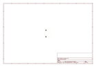
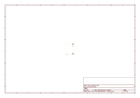
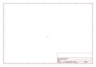
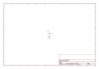

# OOMP Project  
## Adafruit-DRV8833-Motor-Driver-Breakout-PCB  by adafruit  
  
(snippet of original readme)  
  
-- Adafruit DRV8833 Motor Driver Breakout PCB  
  
<a href="http://www.adafruit.com/products/3297">   
Click here to purchase one from the Adafruit shop</a>  
  
PCB files for the Adafurit DRV8833 Motor Driver Breakout. Format is EagleCAD schematic and board layout  
* https://www.adafruit.com/product/3297  
  
--- DESCRIPTION  
Spin two DC motors or step one bi-polar or uni-polar stepper with up to 1.2A per channel using the DRV8833. This motor driver chip is a nice alternative to the TB6612 driver. Like that chip, you get 2 full H-bridges, but this chip is better for low voltage uses (can run from 2.7V up to 10.8V motor power) and has built in current limiting capability. We set it up for 1A current limiting so you don't get more than 2A per chip, but you can also disable the current limiting, or change it to a different limit!  
  
We solder on DRV8833 onto a breakout board for you here, with a polarity protection FET on the motor voltage input. Each breakout chip contains two full H-bridges (four half H-bridges). That means you can drive two DC motors bi-directionally, or one stepper motor. Just make sure they're good for about 1.2 Amp or less of current, since that's the limit of this chip. They do handle a peak of 2A but that's just for a short amount of time, if you turn off the current limiting we set. What we like most about this particular driver is that it comes with built in kick-back diodes internally so you dont have to worry abo  
  full source readme at [readme_src.md](readme_src.md)  
  
source repo at: [https://github.com/adafruit/Adafruit-DRV8833-Motor-Driver-Breakout-PCB](https://github.com/adafruit/Adafruit-DRV8833-Motor-Driver-Breakout-PCB)  
## Board  
  
  
## Schematic  
  
  
  
[schematic pdf](working_schematic.pdf)  
## Images  
  
  
  
  
  
  
  
  
  
  
  
  
  
  
  
  
