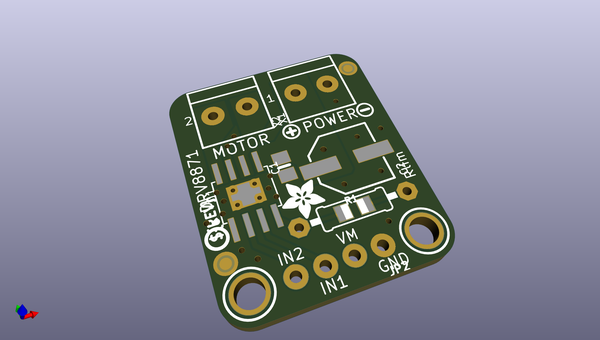
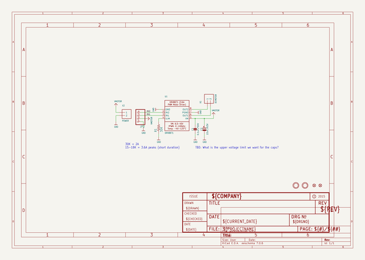
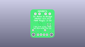
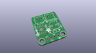
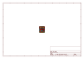
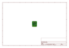
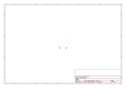
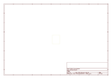

# OOMP Project  
## Adafruit-DRV8871-Breakout-PCB  by adafruit  
  
(snippet of original readme)  
  
-- Adafruit DRV8871 DC Motor Driver Breakout Board PCB  
<a href="http://www.adafruit.com/products/3190">   
Click here to purchase one from the Adafruit shop</a>  
  
Crank up your robotics with powerful Adafruit DRV8871 motor driver breakout board. This motor driver has a lot of great specs that make it useful for a wide variety of mechatronics. In particular, the simple resistor-set current limiting and auto-magic PWM support make it super easy to use with just about any brushed DC motor.  
  
PCB files for the Adafruit DRV8871 Breakout. The format is EagleCAD schematic and board layout  
- https://www.adafruit.com/product/3190  
  
--- License  
  
Adafruit invests time and resources providing this open source design, please support Adafruit and open-source hardware by purchasing products from [Adafruit](https://www.adafruit.com)!  
  
All text above must be included in any redistribution  
  
Designed by Limor Fried/Ladyada for Adafruit Industries.  
Creative Commons Attribution/Share-Alike, all text above must be included in any redistribution.   
See license.txt for additional information.  
  
  full source readme at [readme_src.md](readme_src.md)  
  
source repo at: [https://github.com/adafruit/Adafruit-DRV8871-Breakout-PCB](https://github.com/adafruit/Adafruit-DRV8871-Breakout-PCB)  
## Board  
  
  
## Schematic  
  
  
  
[schematic pdf](working_schematic.pdf)  
## Images  
  
  
  
  
  
  
  
  
  
  
  
  
  
  
  
  
