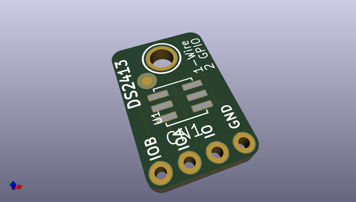
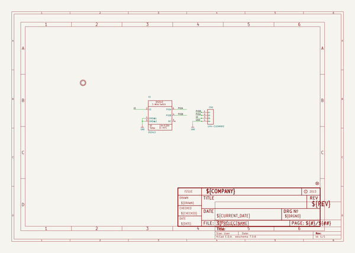
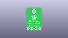
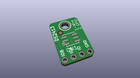
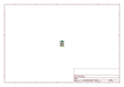
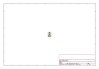
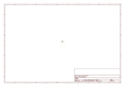
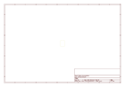
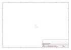

# OOMP Project  
## Adafruit-DS2413-PCB  by adafruit  
  
oomp key: oomp_projects_flat_adafruit_adafruit_ds2413_pcb  
(snippet of original readme)  
  
-- DS2413 1-Wire Two GPIO Controller Breakout PCB  
<a href="http://www.adafruit.com/products/1551">   
Click here to purchase one from the Adafruit shop</a>  
  
You're too cool for I2C, and SPI has so many wires, 8-bit parallel... how can that be fashionable!? You are a 1-Wire kinda gal, and you want more 1-Wire breakouts in your life to complement all of your great engineering. Well rock on, because here you go, it's a 1-Wire controller with two open-drain GPIO.  
  
You can put as many of the DS2413's as you want on a single I/O line, each one is uniquely addressable and shares the single I/O pin happily. The two controllable I/O lines (PIOA and PIOB) can be used as inputs or outputs. They are open-drain, so if you want to power an LED or something, you'll need a remote power supply (see Maxim's product page for more details)  
  
PCB files for the Adafruit DS2413 1-Wire GPIO Breakout, The format is EagleCAD schematic and board layout  
- http://www.adafruit.com/products/1551  
  
--- License  
  
Adafruit invests time and resources providing this open source design, please support Adafruit and open-source hardware by purchasing products from [Adafruit](https://www.adafruit.com)!  
  
All text above must be included in any redistribution  
  
Designed by Limor Fried/Ladyada for Adafruit Industries.  
Creative Commons Attribution/Share-Alike, all text above must be included in any redistribution.   
See license.txt for additional information.  
  
  full source readme at [readme_src.md](readme_src.md)  
  
source repo at: [https://github.com/adafruit/Adafruit-DS2413-PCB](https://github.com/adafruit/Adafruit-DS2413-PCB)  
## Board  
  
  
## Schematic  
  
  
  
[schematic pdf](working_schematic.pdf)  
## Images  
  
  
  
  
  
  
  
  
  
  
  
  
  
  
  
  
