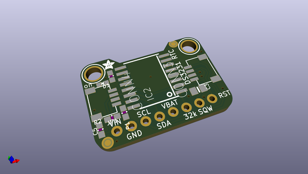
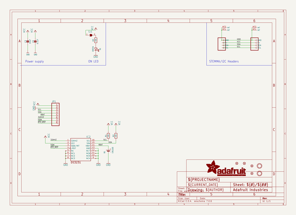
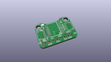
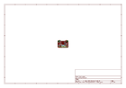
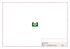
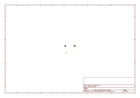
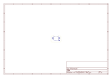
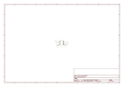

# OOMP Project  
## Adafruit-DS3231-Precision-RTC-Breakout-PCB  by adafruit  
  
(snippet of original readme)  
  
-- Adafruit DS3231 Precision RTC Breakout PCB  
<a href="http://www.adafruit.com/products/5188">   
Click here to purchase one from the Adafruit shop</a>   
<a href="http://www.adafruit.com/products/3013">   
Click here to purchase one from the Adafruit shop</a>  
  
The datasheet for the DS3231 explains that this part is an "Extremely Accurate I²C-Integrated RTC/TCXO/Crystal". And, hey, it does exactly what it says on the tin! This Real Time Clock (RTC) is the most precise you can get in a small, low power package.  
  
Most RTCs use an external 32kHz timing crystal that is used to keep time with low current draw. And that's all well and good, but those crystals have slight drift, particularly when the temperature changes (the temperature changes the oscillation frequency very very very slightly but it does add up!) This RTC is in a beefy package because the crystal is inside the chip! And right next to the integrated crystal is a temperature sensor. That sensor compensates for the frequency changes by adding or removing clock ticks so that the timekeeping stays on schedule.  
  
This is the finest RTC you can get, and now we have it in a compact, breadboard-friendly breakout. With a coin cell plugged into the back, you can get years of precision timekeeping, even when main power is lost. Great for datalogging and clocks, or anything where you need to really know the time.  
  
PCB files  
  full source readme at [readme_src.md](readme_src.md)  
  
source repo at: [https://github.com/adafruit/Adafruit-DS3231-Precision-RTC-Breakout-PCB](https://github.com/adafruit/Adafruit-DS3231-Precision-RTC-Breakout-PCB)  
## Board  
  
  
## Schematic  
  
  
  
[schematic pdf](working_schematic.pdf)  
## Images  
  
  
  
  
  
  
  
  
  
  
  
  
  
  
  
  
