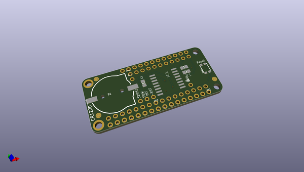
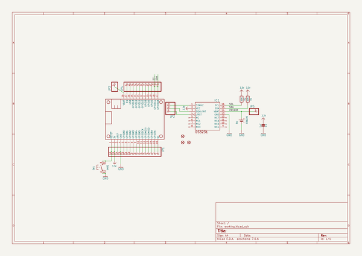
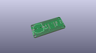
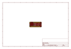
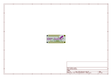
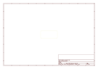
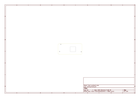
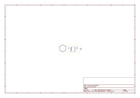

# OOMP Project  
## Adafruit-DS3231-Precision-RTC-FeatherWing-PCB  by adafruit  
  
(snippet of original readme)  
  
-- DS3231 Precision RTC FeatherWing - RTC Add-on PCB  
<a href="http://www.adafruit.com/products/3028">   
Click here to purchase one from the Adafruit shop</a>  
  
A Feather board without ambition is a Feather board without FeatherWings! This is the DS3231 Precision RTC FeatherWing: it adds an extremely accurate I2C-integrated Real Time Clock (RTC) with a Temperature Compensated Crystal Oscillator (TCXO)  to any Feather main board. This RTC is the most precise you can get in a small, low power package. Using our Feather Stacking Headers or Feather Female Headers you can connect a FeatherWing on top of your Feather board and let the board take flight!  
  
Most RTCs use an external 32kHz timing crystal that is used to keep time with low current draw. And that's all well and good, but those crystals have slight drift, particularly when the temperature changes (the temperature changes the oscillation frequency very very very slightly but it does add up!) This RTC is in a beefy package because the crystal is inside the chip! And right next to the integrated crystal is a temperature sensor. That sensor compensates for the frequency changes by adding or removing clock ticks so that the timekeeping stays on schedule.  
  
PCB files for the DS3231 Precision RTC FeatherWing. The format is EagleCAD schematic and board layout  
- https://www.adafruit.com/products/3028  
  
--- License  
  
Adafruit invests time and resources providing this open source desi  
  full source readme at [readme_src.md](readme_src.md)  
  
source repo at: [https://github.com/adafruit/Adafruit-DS3231-Precision-RTC-FeatherWing-PCB](https://github.com/adafruit/Adafruit-DS3231-Precision-RTC-FeatherWing-PCB)  
## Board  
  
  
## Schematic  
  
  
  
[schematic pdf](working_schematic.pdf)  
## Images  
  
  
  
  
  
  
  
  
  
  
  
  
  
  
  
  
