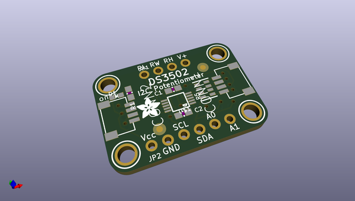
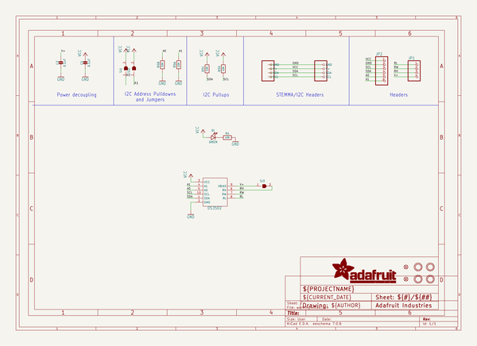

# OOMP Project  
## Adafruit-DS3502-PCB  by adafruit  
  
(snippet of original readme)  
  
-- Adafruit DS3502 I2C Digital 10K Potentiometer  PCB  
  
<a href="http://www.adafruit.com/products/4286">   
Click here to purchase one from the Adafruit shop</a>  
  
PCB files for the Adafruit DS3502 I2C Digital 10K Potentiometer .   
  
Format is EagleCAD schematic and board layout  
* https://www.adafruit.com/product/4286  
  
--- Description  
  
If you're a person like me that gets exhausted turning knobs all day, the DS3502 is just the ticket to calm all your knob-turning related troubles. Instead of having to _turn knobs_ with your _HANDS_ like an _ANIMAL_ the DS3502 I2C Digital Potentiometer allows you to let your microcontroller adjust the resistance for you! Now you can free your hands to spin your fidget spinner or or eat a slice of pizza while you're on the phone. Talking over an I2C bus, your Arduino, CircuitPython board,  or Python powered computer can talk to the DS3502 and tell it to vary its resistance at your beck and call.  
  
Working with the DS3502 is easy as an I2C controllable pie. We've  put it on a breakout PCB with the required support circuitry and [SparkFun qwiic](https://www.sparkfun.com/qwiic) compatible [STEMMA QT](https://learn.adafruit.com/introducing-adafruit-stemma-qt) connectors to allow you to use it with other similarly equipped boards **without needing to solder.** This handy little helper can work with 3.3V or 5V micros, so it's ready to get to work with a range of development boards. The DS3502 is a simple  
  full source readme at [readme_src.md](readme_src.md)  
  
source repo at: [https://github.com/adafruit/Adafruit-DS3502-PCB](https://github.com/adafruit/Adafruit-DS3502-PCB)  
## Board  
  
  
## Schematic  
  
  
  
[schematic pdf](working_schematic.pdf)  
## Images  
  
  
  
  
  
  
  
  
  
  
  
  
  
  
  
  
