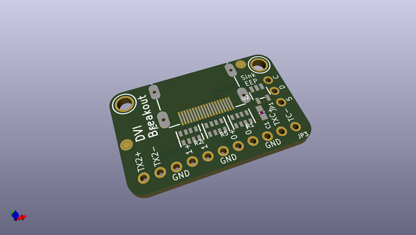
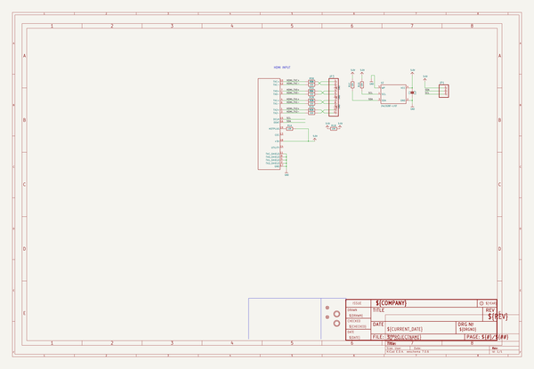
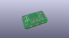
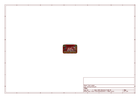
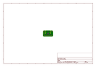
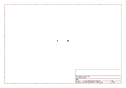
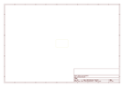
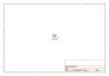

# OOMP Project  
## Adafruit-DVI-Breakout-Board-PCB  by adafruit  
  
oomp key: oomp_projects_flat_adafruit_adafruit_dvi_breakout_board_pcb  
(snippet of original readme)  
  
-- Adafruit DVI Breakout Board - For HDMI Source Devices PCB  
  
<a href="http://www.adafruit.com/products/4984">   
Click here to purchase one from the Adafruit shop</a>  
  
PCB files for the Adafruit DVI Breakout Board - For HDMI Source Devices.   
  
Format is EagleCAD schematic and board layout  
* https://www.adafruit.com/product/4984  
  
--- Description  
  
We designed this little breakout board after seeing some cool demos for the Raspberry Pi Pico driving an HDMI display. By using some fun 'abuse' of overclocking and the RP2040's PIO system a low-cost microcontroller can have great looking video output. Great for making demos, or just noodling around with digital video generation.  
  
This breakout board has no active components on it. It's just a connector you can plug an HDMI/DVI cable into, and 220 ohm series resistors. There's a spot for an I2C EEPROM and some resistors, but those are for advanced folks who may want to create a 'sink' device with an EDID. We don't place those parts on this breakout, since this is intended to be a 'source' only!  
  
Wire it up to the bottom pins of your Pico board with the following:  
  
GP12 to D0+  
  
GP13 to D0-  
  
GP14 to CK+  
  
GP15 to CK-  
  
GP16 to D2+  
  
GP17 to D2-  
  
GP18 to D1+  
  
GP19 to D1-  
  
And tie all the grounds together to one ground pin. Then you can download this superfun example that will give you bouncy Eben heads (from this tutorial)  
  
--- License  
  
Adafruit invests time and resources providing this op  
  full source readme at [readme_src.md](readme_src.md)  
  
source repo at: [https://github.com/adafruit/Adafruit-DVI-Breakout-Board-PCB](https://github.com/adafruit/Adafruit-DVI-Breakout-Board-PCB)  
## Board  
  
  
## Schematic  
  
  
  
[schematic pdf](working_schematic.pdf)  
## Images  
  
  
  
  
  
  
  
  
  
  
  
  
  
  
  
  
