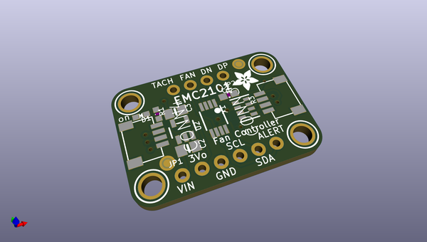
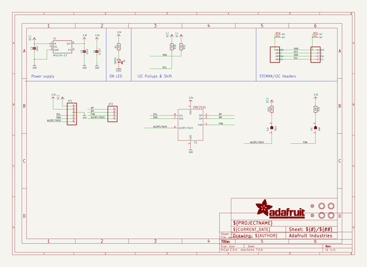
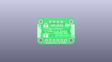
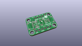
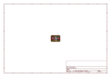
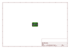
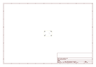
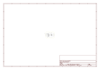

# OOMP Project  
## Adafruit-EMC2101-PCB  by adafruit  
  
(snippet of original readme)  
  
-- Adafruit EMC2101 Tempature Sensor and Fan Controller PCB  
  
<a href="http://www.adafruit.com/products/4808">   
Click here to purchase one from the Adafruit shop</a>  
  
PCB files for the Adafruit EMC2101 Tempature Sensor and Fan Controller.   
  
Format is EagleCAD schematic and board layout  
* https://www.adafruit.com/product/4808  
  
--- Description  
  
Cooling fans. They're everywhere, and they serve the important purpose of keeping things cool, generally electronics. One might rightfully think: "these fans are pretty good at moving air to keep things cool; maybe I can use one of these neat computer fans to keep my widget frosty" followed closely by throwing up one's hands in confusion at the sight of a 3 or even 4-pin connector. OK, power takes two pins but what are these other pins for and how do I use them to convince this fan to keep my things chilly?  
  
The EMC2101 from Microchip/SMSC is a 1 degree C accurate fan controller with temperature monitoring and it will take care of all of that for you. Those extra pins allow you to set a the speed of the fan, and in the additional pin of a 4-pin connector adds a tachometer output that allows you (or the EMC2101) to monitor the speed of the fan to make sure it's working as expected. In addition to allowing you to control a fan, the EMC2101 includes an internal temperature sensor, as well as connections for an external temperature sensing diode. If you use an external temperature sensor,   
  full source readme at [readme_src.md](readme_src.md)  
  
source repo at: [https://github.com/adafruit/Adafruit-EMC2101-PCB](https://github.com/adafruit/Adafruit-EMC2101-PCB)  
## Board  
  
  
## Schematic  
  
  
  
[schematic pdf](working_schematic.pdf)  
## Images  
  
  
  
  
  
  
  
  
  
  
  
  
  
  
  
  
