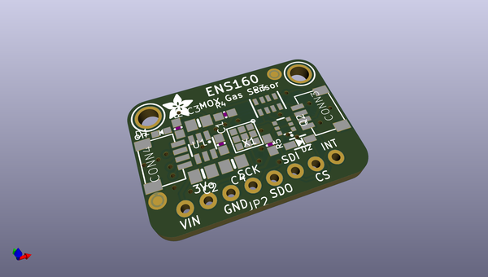
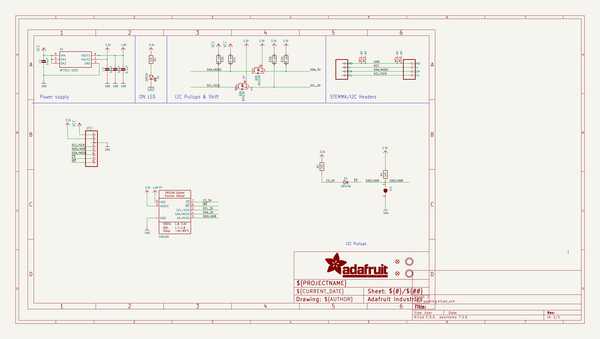
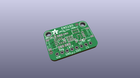
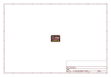
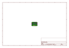
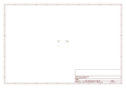
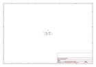

# OOMP Project  
## Adafruit-ENS160-PCB  by adafruit  
  
oomp key: oomp_projects_flat_adafruit_adafruit_ens160_pcb  
(snippet of original readme)  
  
-- Adafruit ENS160 MOX Gas Sensor PCB  
  
<a href="http://www.adafruit.com/products/5606">   
Click here to purchase one from the Adafruit shop</a>  
  
PCB files for the Adafruit ENS160 MOX Gas Sensor.   
  
Format is EagleCAD schematic and board layout  
* https://www.adafruit.com/product/5606  
  
--- Description  
  
*sniff* *sniff* ... do you smell that? No need to stick your nose into a carton of milk anymore, you can build a digital nose with the ENS160 Gas Sensor, a fully integrated MOX gas sensor. This is a very fine air quality sensor from the sensor experts at ScioSense, with I2C interfacing so you don't have to manage the heater and analog reading of a MOX sensor. It combines multiple metal-oxide sensing and heating elements on one chip to provide more detailed air quality signals.  
  
The ENS160 is the replacement for the popular, but now-discontinued CCS811. It has similar functionality but does require all new driver code so be aware if you are updating from an original design with the CCS811 that some work is required to upgrade.  
  
The ENS160 has a 'standard' hot-plate MOX sensor, as well as a small microcontroller that controls power to the plate, reads the analog voltage, and provides an I2C interface to read from. ScioSense provides an Arduino library with examples of reading the four raw resistance values and also the TVOC and eCO2 and a Python/CircuitPython library that can be used with Linux computers like the Raspberry Pi or o  
  full source readme at [readme_src.md](readme_src.md)  
  
source repo at: [https://github.com/adafruit/Adafruit-ENS160-PCB](https://github.com/adafruit/Adafruit-ENS160-PCB)  
## Board  
  
  
## Schematic  
  
  
  
[schematic pdf](working_schematic.pdf)  
## Images  
  
  
  
  
  
  
  
  
  
  
  
  
  
  
  
  
