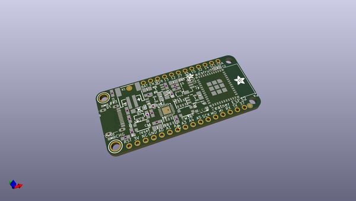
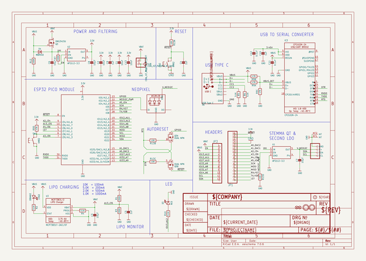
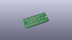
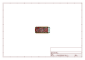
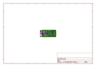
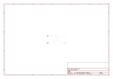
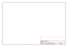
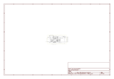

# OOMP Project  
## Adafruit-ESP32-Feather-V2-PCB  by adafruit  
  
(snippet of original readme)  
  
-- Adafruit ESP32 Feather V2 PCB  
  
<a href="http://www.adafruit.com/products/5400">   
Click here to purchase one from the Adafruit shop</a>  
  
PCB files for the Adafruit ESP32 Feather V2.   
  
Format is EagleCAD schematic and board layout  
* https://www.adafruit.com/product/5400  
  
--- Description  
  
One of our star Feathers is the Adafruit HUZZAH32 ESP32 Feather - with the fabulous ESP32 WROOM module on there, it makes quick work of WiFi and Bluetooth projects that take advantage of Espressifs most popular chipset. Recently we had to redesign this feather to move from the obsolete CP2104 to the CP2012N and one thing led to another and before you know it we made a completely refreshed design: the Adafruit ESP32 Feather V2.  
  
The V2 is a significant redesign, enough so we consider it a completely new product. It still features the ESP32 chip but has many upgrades and improvements:  
  
* Compared to the original Feather with 4 MB Flash and no PSRAM, the V2 has 8 MB Flash and 2 MB PSRAM  
* Additional user button tactile switch on input pin 38  
* Additional NeoPixel mini RGB LED with controllable power pin  
* Additional STEMMA QT port for plug and play I2C connections  
* USB Type C port instead of Micro B  
* Separate controllable 3.3V power supply for STEMMA QT to allow for ultra low power consumption even with sensors are attached  
* Designed for low power usage: verified with a PPK to draw 70uA from the Lipoly battery in deep sleep and 1.2mA in l  
  full source readme at [readme_src.md](readme_src.md)  
  
source repo at: [https://github.com/adafruit/Adafruit-ESP32-Feather-V2-PCB](https://github.com/adafruit/Adafruit-ESP32-Feather-V2-PCB)  
## Board  
  
  
## Schematic  
  
  
  
[schematic pdf](working_schematic.pdf)  
## Images  
  
  
  
  
  
  
  
  
  
  
  
  
  
  
  
  
