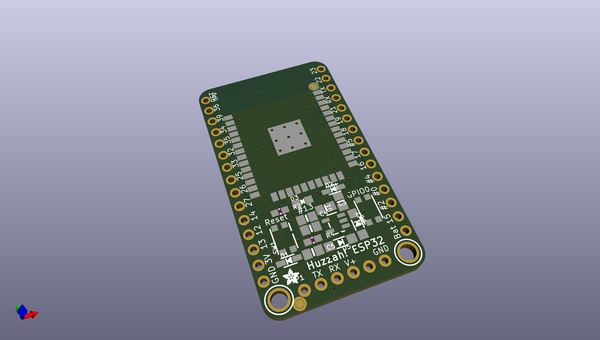
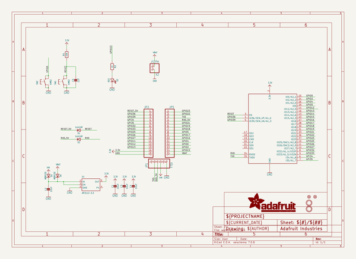
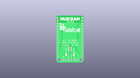
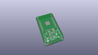
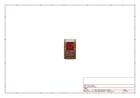
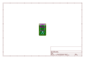
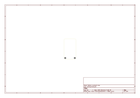
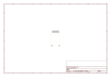
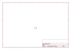

# OOMP Project  
## Adafruit-ESP32-HUZZAH-Breakout-PCB  by adafruit  
  
(snippet of original readme)  
  
-- Adafruit HUZZAH32 PCB  
  
<a href="http://www.adafruit.com/products/4172">   
Click here to purchase one from the Adafruit shop</a>  
  
PCB files for the Adafruit HUZZAH32.   
  
Format is EagleCAD schematic and board layout  
* https://www.adafruit.com/product/4172  
  
--- Description  
  
Squeeeeze down your next ESP32 project to its bare-bones essential with the **Adafruit HUZZAH32 Breakout**. This breakout is basically the 'big sister' of our HUZZAH 8266, but instead of an ESP8266 it has the '32! We've pared down our popular [Feather ESP32](https://www.adafruit.com/product/3405), removing the battery charger and USB-serial converter. You just get a regulator, some protection diodes, two buttons and an LED. For some projects, where price and size are at a premium, you can program this board over the 'FTDI cable' breakout when needed, and leave it alone otherwise.  
  
Note that this board doesn't come with a USB to serial converter chip and auto-reset circuit. Instead, you will need to plug in a [CP2104 Friend](https://www.adafruit.com/product/3309) or [FTDI cable](https://www.adafruit.com/product/70). Then, before uploading code, put it into bootloader mode by holding down the GPIO -0 button and clicking Reset button, then releasing the -0 button.  
  
That module in the middle of the breakout contains a dual-core ESP32 chip, 4 MB of SPI Flash, tuned antenna, and all the passives you need to take advantage of this powerful new processor. The ES  
  full source readme at [readme_src.md](readme_src.md)  
  
source repo at: [https://github.com/adafruit/Adafruit-ESP32-HUZZAH-Breakout-PCB](https://github.com/adafruit/Adafruit-ESP32-HUZZAH-Breakout-PCB)  
## Board  
  
  
## Schematic  
  
  
  
[schematic pdf](working_schematic.pdf)  
## Images  
  
  
  
  
  
  
  
  
  
  
  
  
  
  
  
  
