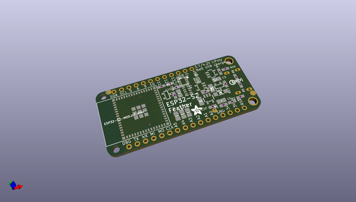
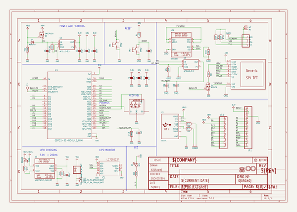
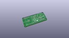
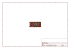
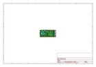
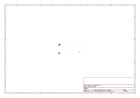
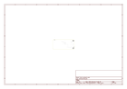
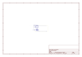
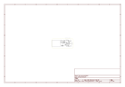

# OOMP Project  
## Adafruit-ESP32-S2-TFT-Feather-PCB  by adafruit  
  
(snippet of original readme)  
  
-- Adafruit ESP32-S2 TFT Feather - 4MB Flash, 2MB PSRAM, STEMMA QT PCB  
  
<a href="http://www.adafruit.com/products/5300">   
Click here to purchase one from the Adafruit shop</a>  
  
PCB files for the Adafruit ESP32-S2 TFT Feather - 4MB Flash, 2MB PSRAM, STEMMA QT.   
  
Format is EagleCAD schematic and board layout  
* https://www.adafruit.com/product/5300  
  
--- Description  
  
We've got a new machine here at Adafruit, it can uncover your deepest desires. Don't believe me? I'll turn it on right now to prove it to you! What, you want unlimited mozzarella sticks? OK well, that's not something we can provide. But we can provide your second-deepest desire: an ESP32-S2 Feather board with a built in IPS TFT color display. It's got all the gooeyness of a mozzarella stick features of a Feather main board, the comforting warmth of an ESP32-S2 WiFi microcontroller, and the crispness of a 240x135 pixel color TFT display. All that and it will even plug in nicely into a breadboard, terminal block wing, or Feather Doubler or even just stack on top of another wing.  
  
This feather comes with native USB and 4 MB flash + 2 MB of PSRAM, so it is perfect for use with CircuitPython or Arduino with low-cost WiFi. Native USB means it can act like a keyboard or a disk drive. WiFi means its awesome for IoT projects. And Feather means it works with the large community of Feather Wings for expandability.  
  
The ESP32-S2 is a highly-integrated, low-power, 2.4 GHz Wi-F  
  full source readme at [readme_src.md](readme_src.md)  
  
source repo at: [https://github.com/adafruit/Adafruit-ESP32-S2-TFT-Feather-PCB](https://github.com/adafruit/Adafruit-ESP32-S2-TFT-Feather-PCB)  
## Board  
  
  
## Schematic  
  
  
  
[schematic pdf](working_schematic.pdf)  
## Images  
  
  
  
  
  
  
  
  
  
  
  
  
  
  
  
  
