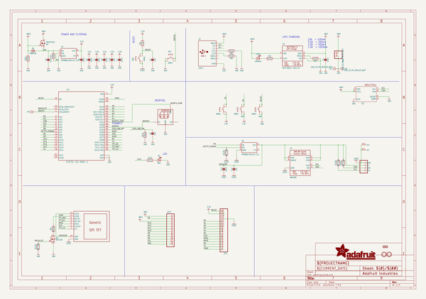
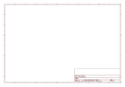

# OOMP Project  
## Adafruit-ESP32-S3-Reverse-TFT-Feather-PCB  by adafruit  
  
(snippet of original readme)  
  
-- Adafruit ESP32-S3 Reverse TFT Feather - 4MB Flash, 2MB PSRAM, STEMMA QT PCB  
  
<a href="http://www.adafruit.com/products/5691">   
Click here to purchase one from the Adafruit shop</a>  
  
PCB files for the Adafruit ESP32-S3 Reverse TFT Feather - 4MB Flash, 2MB PSRAM, STEMMA QT.   
  
Format is EagleCAD schematic and board layout  
* https://www.adafruit.com/product/5691  
  
--- Description  
  
Like Missy Elliot, we like to "put our [Feather] down, flip it and reverse it" and that's exactly what we've done with this new development board. It's basically our ESP32-S3 TFT Feather but with the 240x135 color TFT display on the back-side not the front-side. That makes it great for panel-mounted projects, particularly since we've also got some space for 3 buttons to go along. It's like an all-in-one display interface dev board, powered by the fantastic ESP32-S3 WIFI module.  
  
This Feather comes with native USB and 4 MB Flash + 2 MB of PSRAM, so it is perfect for use with CircuitPython or Arduino with low-cost WiFi. Native USB means it can act like a keyboard or a disk drive. WiFi means it's awesome for IoT projects. And Feather means it works with the large community of Feather Wings for expandability.  
  
The ESP32-S3 is a highly-integrated, low-power, 2.4 GHz Wi-Fi/BLE System-on-Chip (SoC) solution that has built-in native USB as well as some other interesting new technologies like Time of Flight distance measurements and AI acceleration. With  
  full source readme at [readme_src.md](readme_src.md)  
  
source repo at: [https://github.com/adafruit/Adafruit-ESP32-S3-Reverse-TFT-Feather-PCB](https://github.com/adafruit/Adafruit-ESP32-S3-Reverse-TFT-Feather-PCB)  
## Board  
  
  
## Schematic  
  
  
  
[schematic pdf](working_schematic.pdf)  
## Images  
  
  
  
  
  
  
  
  
  
  
  
  
  
  
  
  
