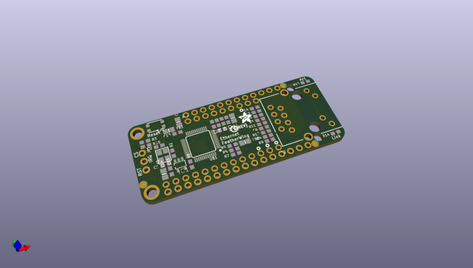
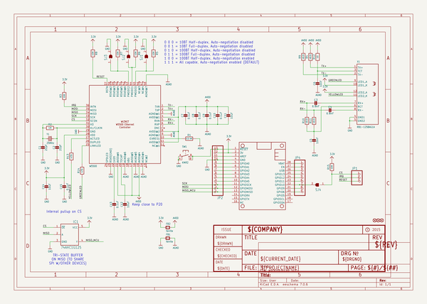
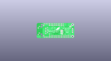
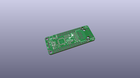
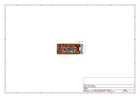
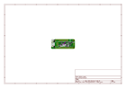
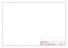
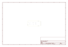
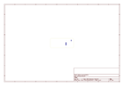
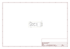

# OOMP Project  
## Adafruit-Ethernet-FeatherWing-PCB  by adafruit  
  
oomp key: oomp_projects_flat_adafruit_adafruit_ethernet_featherwing_pcb  
(snippet of original readme)  
  
-- Adafruit Ethernet FeatherWing PCB  
<a href="http://www.adafruit.com/products/3201">   
Click here to purchase one from the Adafruit shop</a>  
  
Wireless is wonderful, but sometimes you want the strong reliability of a wire. If your Feather board is going to be part of a permanent installation, this Ethernet FeatherWing will let you add quick and easy wired Internet. Just plug in a standard ethernet cable, and run the Ethernet2 library for cross-platform networking. Works with all/any of our Feather boards as an Ethernet Client (server not supported at this time)!  
  
Ethernet is a tried-and-true networking standard. It's supported by every hub and switch, and because there's a physical connection you don't have to noodle around with SSIDs, passwords, authentication schemes or antennas. It works great with any of our Feathers, the WIZ5500 chip communicates over SPI plus a single CS pin. The Arduino Ethernet2 library works great, and within a few seconds after connecting, will do the DHCP setup for you. As a nice extra, the RJ-45 jack has both link and activity lights that will light/blink to let you know the current connection status.  
  
PCB files for the Adafruit  Ethernet FeatherWing. The format is EagleCAD schematic and board layout  
- https://www.adafruit.com/products/3201  
  
--- License  
  
Adafruit invests time and resources providing this open source design, please support Adafruit and open-source hardware by purchasing products  
  full source readme at [readme_src.md](readme_src.md)  
  
source repo at: [https://github.com/adafruit/Adafruit-Ethernet-FeatherWing-PCB](https://github.com/adafruit/Adafruit-Ethernet-FeatherWing-PCB)  
## Board  
  
  
## Schematic  
  
  
  
[schematic pdf](working_schematic.pdf)  
## Images  
  
  
  
  
  
  
  
  
  
  
  
  
  
  
  
  
