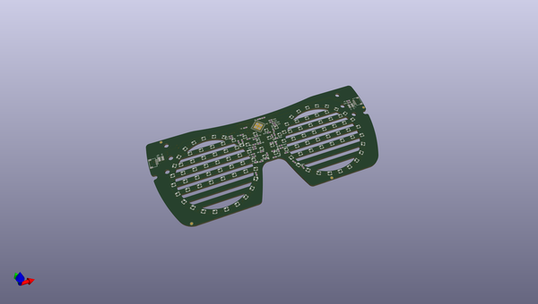
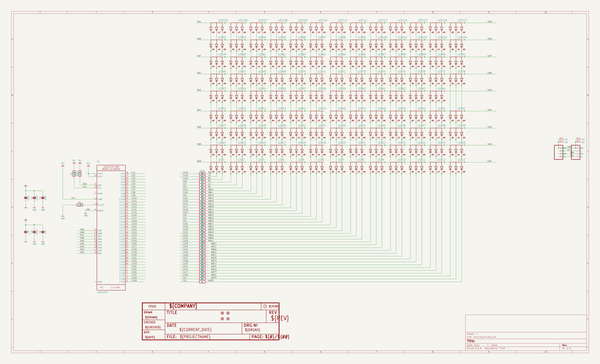
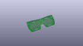
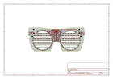
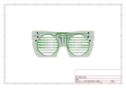
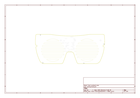
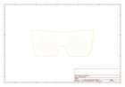
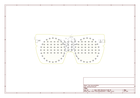

# OOMP Project  
## Adafruit-EyeLights-LED-Glasses-and-Driver-PCB  by adafruit  
  
oomp key: oomp_projects_flat_adafruit_adafruit_eyelights_led_glasses_and_driver_pcb  
(snippet of original readme)  
  
-- Adafruit EyeLights LED Glasses and Driver PCB  
  
<a href="http://www.adafruit.com/products/5217">   
Click here to purchase the EyeLights Glasses Driver from the Adafruit shop</a>  
<a href="http://www.adafruit.com/products/5210">   
Click here to purchase the EyeLights Glasses from the Adafruit shop</a>  
  
PCB files for the Adafruit EyeLights LED Glasses and Driver.   
  
Format is EagleCAD schematic and board layout  
* https://www.adafruit.com/product/5217  
* https://www.adafruit.com/product/5210  
  
--- Description  
  
This board is designed to be a thin, bluetooth-enabled driver board for our Adafruit LED Glasses RGB LED matrix. That said, it's a perfectly good stand-alone development board for the Nordic nRF52840 chipset, with a very slim design, optional LiPo battery support, a few sensors, and a Stemma QT port for adding other devices or sensors with I2C plug-and-play.  
  
The driver looks a little like a Feather but it does not have any breakout pins to keep it very compact. If you need access to GPIO pins, we recommend an nRF52840 ItsyBitsy, nRF52840 Feather or Feather Sense.  
  
In exchange for GPIO outputs, we added some sensors on instead: each board comes with a LIS3DH triple-axis accelerometer that can be used for motion and orientation sensing, and a PDM digital microphone for audio sensing. To add more sensors or connect to the LED Glasses front panel, there's a  STEMMA QT conne  
  full source readme at [readme_src.md](readme_src.md)  
  
source repo at: [https://github.com/adafruit/Adafruit-EyeLights-LED-Glasses-and-Driver-PCB](https://github.com/adafruit/Adafruit-EyeLights-LED-Glasses-and-Driver-PCB)  
## Board  
  
  
## Schematic  
  
  
  
[schematic pdf](working_schematic.pdf)  
## Images  
  
  
  
  
  
  
  
  
  
  
  
  
  
  
  
  
