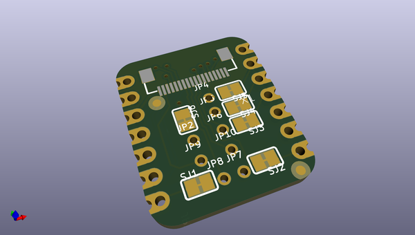
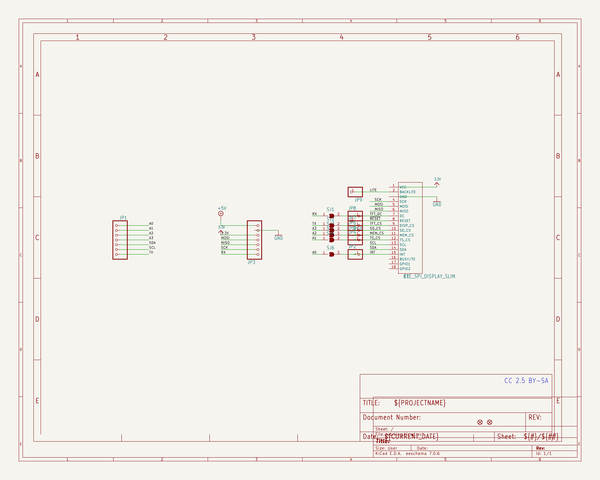
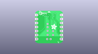
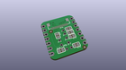
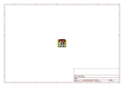
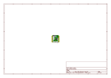
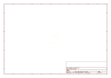
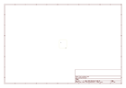
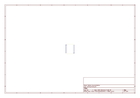
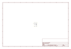

# OOMP Project  
## Adafruit-EYESPI-BFF-PCB  by adafruit  
  
(snippet of original readme)  
  
-- Adafruit EYESPI BFF for QT Py or Xiao - 18 Pin FPC Connector PCB  
  
<a href="http://www.adafruit.com/products/5772">   
Click here to purchase one from the Adafruit shop</a>  
  
PCB files for the Adafruit EYESPI BFF for QT Py or Xiao - 18 Pin FPC Connector.   
  
Format is EagleCAD schematic and board layout  
* https://www.adafruit.com/product/5772  
  
--- Description  
  
Our QT Py boards are a great way to make very small microcontroller projects that pack a ton of power - and now we have a way for you to add a small, colorful, and bright display to any project.  
  
Our most recent display breakouts have come with a new feature: an 18-pin "EYE SPI" standard FPC connector with flip-top connector. This is intended to be a sort-of "STEMMA QT for displays" - a way to quickly connect and extend display wiring that uses a lot of SPI pins. In this case we need a lot of SPI pins, and we want to be able to use long distances, so we go with an 18-pin 0.5mm pitch FPC.  
  
With such a slim and flexible cable, its a perfect matching for our QT Py boards to make extra smol microcontroller boards with big bold colorful displays or power-sipping E-Ink.   
  
Don't forget you'll also want an 18-pin EYESPI FPC cable. And of course one of our EYESPI displays too - look for the EYESPI logo on the back to know you've got one that can clip in.  
  
* MOSI/MISO/SCK SPI pins are connected to the default SPI port on the QT Py  
* SDA/SCL I2C pins are connected to the I2C port   
  full source readme at [readme_src.md](readme_src.md)  
  
source repo at: [https://github.com/adafruit/Adafruit-EYESPI-BFF-PCB](https://github.com/adafruit/Adafruit-EYESPI-BFF-PCB)  
## Board  
  
  
## Schematic  
  
  
  
[schematic pdf](working_schematic.pdf)  
## Images  
  
  
  
  
  
  
  
  
  
  
  
  
  
  
  
  
