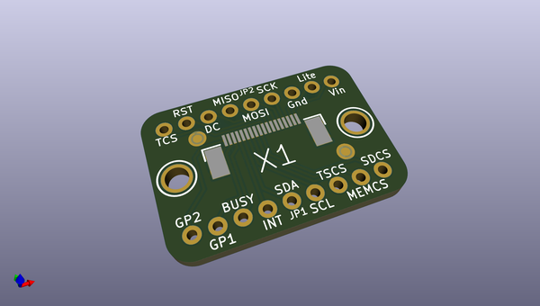
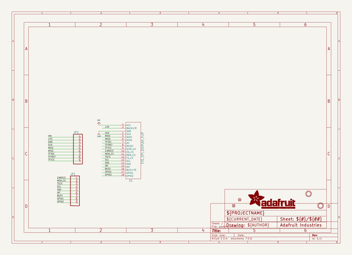
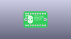
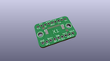
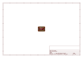
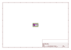
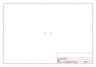
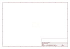

# OOMP Project  
## Adafruit-EYESPI-PCB  by adafruit  
  
oomp key: oomp_projects_flat_adafruit_adafruit_eyespi_pcb  
(snippet of original readme)  
  
-- Adafruit EYESPI Breakout Board PCB  
  
<a href="http://www.adafruit.com/products/5613">   
Click here to purchase one from the Adafruit shop</a>  
  
PCB files for the Adafruit EYESPI Breakout Board.   
  
Format is EagleCAD schematic and board layout  
* https://www.adafruit.com/product/5613  
  
--- Description  
  
Our most recent display breakouts have come with a new feature: an 18-pin "EYE SPI" standard FPC connector with flip-top connector. This is intended to be a sort-of "STEMMA QT for displays" - a way to quickly connect and extend display wiring that uses a lot of SPI pins. In this case we need a lot of SPI pins, and we want to be able to use long distances so we go with an 18-pin 0.5mm pitch FPC.  
  
Now you can connect to the displays, but what goes on the other side of the FPC? Here is one possibility - a simple breakout board that brings all the GPIO to 0.1" spaced header, for breadboarding usage. Each pin usage is labeled, and for most display purposes you only need the left half of the display for power and SPI connectivity.  
  
Don't forget you'll also want an 18-pin EYESPI FPC cable.  
  
  
--- License  
  
Adafruit invests time and resources providing this open source design, please support Adafruit and open-source hardware by purchasing products from [Adafruit](https://www.adafruit.com)!  
  
Designed by Limor Fried/Ladyada for Adafruit Industries.  
  
Creative Commons Attribution/Share-Alike, all text above must be included in any redistribut  
  full source readme at [readme_src.md](readme_src.md)  
  
source repo at: [https://github.com/adafruit/Adafruit-EYESPI-PCB](https://github.com/adafruit/Adafruit-EYESPI-PCB)  
## Board  
  
  
## Schematic  
  
  
  
[schematic pdf](working_schematic.pdf)  
## Images  
  
  
  
  
  
  
  
  
  
  
  
  
  
  
  
  
