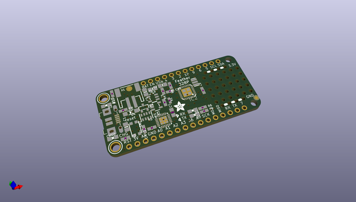
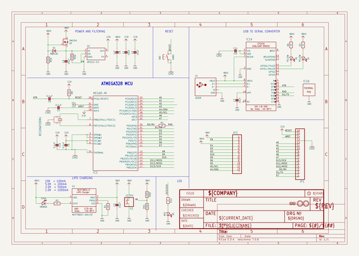
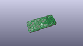
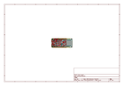
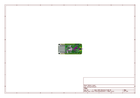
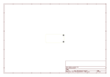
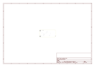
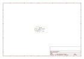

# OOMP Project  
## Adafruit-Feather-328P-PCB  by adafruit  
  
(snippet of original readme)  
  
-- Adafruit Feather 328P PCB  
  
<a href="http://www.adafruit.com/products/3458">   
Click here to purchase one from the Adafruit shop</a>  
  
PCB files for the Adafruit Feather 328P. Format is EagleCAD schematic and board layout  
  
For more details, check out the product page at  
* https://www.adafruit.com/product/3458  
  
--- Description  
  
With this Feather we're getting a little nostalgic for the ATmega328P - the classic 'Arduino' chip - with this Adafruit Feather 328P running a 3.3V and 8 MHz. Feather is the new development board from Adafruit, and like it's namesake it is thin, light, and lets you fly! We designed Feather to be a new standard for portable microcontroller cores. We have other boards in the Feather family, check'em out here.  
  
At the Feather 328P's heart is an ATmega328P clocked at 8 MHz and at 3.3V logic, a chip setup we've had tons of experience with as it's the same as the Pro Mini and similar to the Adafruit Metro 328. This chip has 32K of flash and 2K of RAM, and we paired it with a SiLabs CP2104 to give it USB-to-Serial program & debug capability built in. Works great when you want to keep your classic Arduino code compatibility, but want to use one of our dozens of FeatherWings  
  
To make it easy to use for portable projects, we added a connector for any of our 3.7V Lithium polymer batteries and built in battery charging. You don't need a battery, it will run just fine straight from the micro USB connector. But,   
  full source readme at [readme_src.md](readme_src.md)  
  
source repo at: [https://github.com/adafruit/Adafruit-Feather-328P-PCB](https://github.com/adafruit/Adafruit-Feather-328P-PCB)  
## Board  
  
  
## Schematic  
  
  
  
[schematic pdf](working_schematic.pdf)  
## Images  
  
  
  
  
  
  
  
  
  
  
  
  
  
  
  
  
